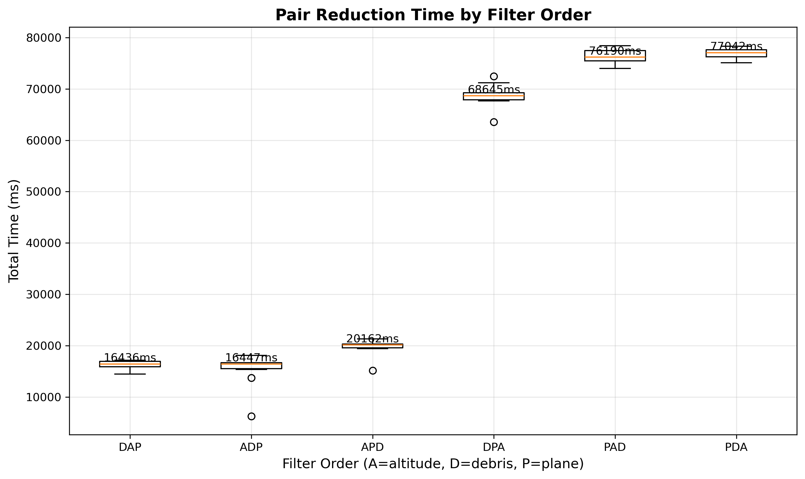
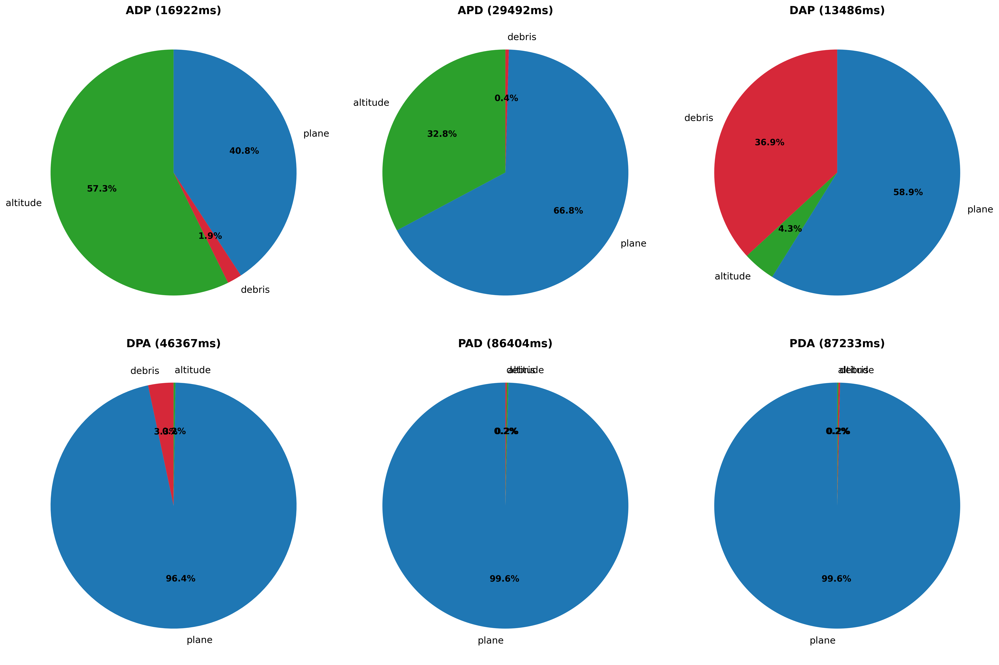
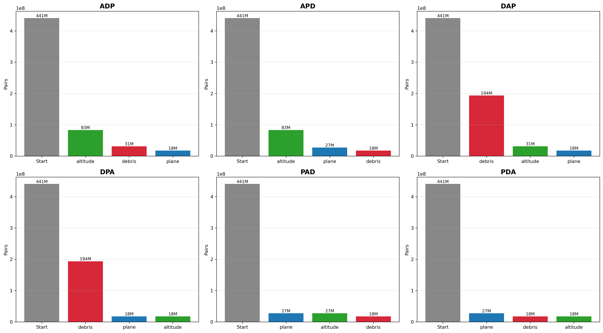

# Pair Reduction Filter Order

With ~30,000 tracked objects, naive N^2 comparison requires checking 441 million satellite pairs. Three geometric
filters reduce this to 4% of original pairs. This experiment determines the optimal filter ordering at 12.5 km
tolerance.

## Filters

Three filters eliminate pairs that cannot possibly collide:

| Filter       | Description                               | Passthrough | Time (as first) |
|--------------|-------------------------------------------|-------------|-----------------|
| **Debris**   | Skip pairs where both objects are debris  | 43.9%       | 4.8s            |
| **Altitude** | Require overlapping perigee/apogee ranges | 18.9%       | 9.6s            |
| **Plane**    | Check orbital plane intersection geometry | 6.2%        | 86.6s           |

- **Debris** is cheapest but least selective - nearly half of pairs pass through
- **Altitude** is 2x slower but 2.3x more selective than debris
- **Plane** is the tightest filter but extremely expensive

## Filter Order Analysis

All orderings produce identical final pair counts (17.6M pairs, 4.0% of original). Only execution time differs.

| Order | Time  | Relative |
|-------|-------|----------|
| DAP   | 13.5s | baseline |
| ADP   | 16.9s | +25%     |
| APD   | 29.5s | +119%    |
| DPA   | 46.4s | +244%    |
| PAD   | 86.4s | +541%    |
| PDA   | 87.2s | +547%    |

## Conclusion

**Optimal order: Debris, Altitude, Plane (DAP)**

Filter ordering has massive impact - DAP is 6.5x faster than PDA despite identical output. Running cheap,
moderately-selective filters before expensive, highly-selective ones is more efficient.







## Running the Benchmark

```bash
# Linux
./mvnw spring-boot:run -Dspring-boot.run.profiles=benchmark-filter

# Windows
./mvnw spring-boot:run "-Dspring-boot.run.profiles=benchmark-filter"
# *you must have a running PostgreSQL instance with the satellite catalog loaded 
```
