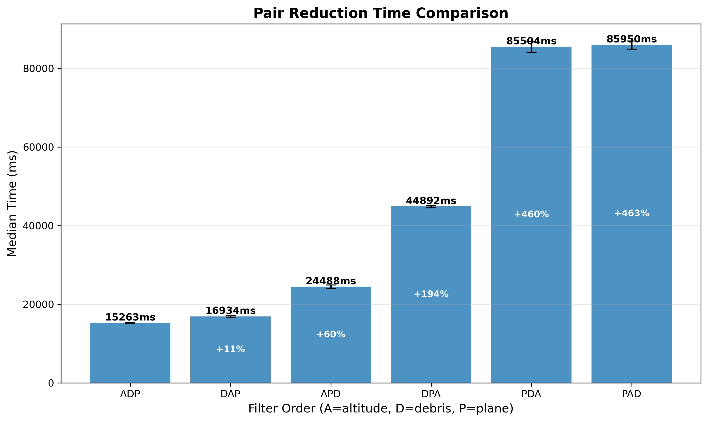

# Pair Reduction Filter Order

With ~30,000 tracked objects, naive N^2 comparison requires checking 441 million satellite pairs. Three geometric
filters reduce this to 4% of original pairs. This experiment determines the optimal filter ordering at 12.5 km
tolerance.

## Filters

Three filters eliminate pairs that cannot possibly collide:

| Filter       | Description                               | Passthrough |
|--------------|-------------------------------------------|-------------|
| **Debris**   | Skip pairs where both objects are debris  | 43.9%       |
| **Altitude** | Require overlapping perigee/apogee ranges | 18.9%       |
| **Plane**    | Check orbital plane intersection geometry | 6.2%        |

First filter runs on all pairs. Subsequent filters only run on pairs that passed previous filters.

## Filter Order Analysis

All orderings produce identical final pair counts (17.6M pairs, 4.0% of original). Only execution time differs.

| Order | Time  | Relative |
|-------|-------|----------|
| ADP   | 15.3s | baseline |
| DAP   | 16.9s | +11%     |
| APD   | 24.5s | +60%     |
| DPA   | 44.9s | +194%    |
| PDA   | 85.5s | +460%    |
| PAD   | 86.0s | +463%    |

**Optimal order: Altitude, Debris, Plane (ADP)** — 1.7s faster than DAP, 5.6× faster than worst ordering.

## Running the Benchmark

```bash
# Linux
./mvnw spring-boot:run -Dspring-boot.run.profiles=benchmark-filter

# Windows
./mvnw spring-boot:run "-Dspring-boot.run.profiles=benchmark-filter"
# *you must have a running PostgreSQL instance with the satellite catalog loaded 
```



