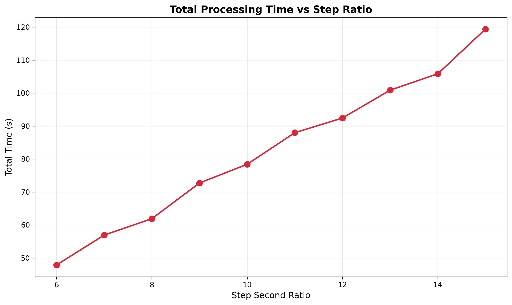
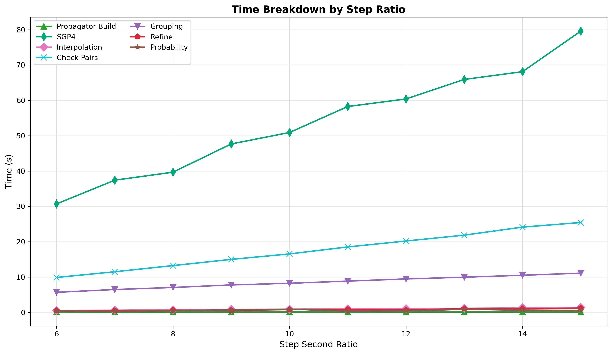
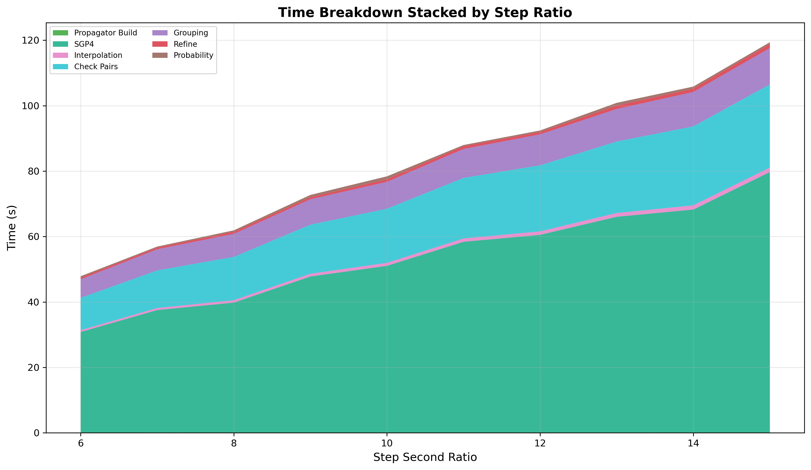
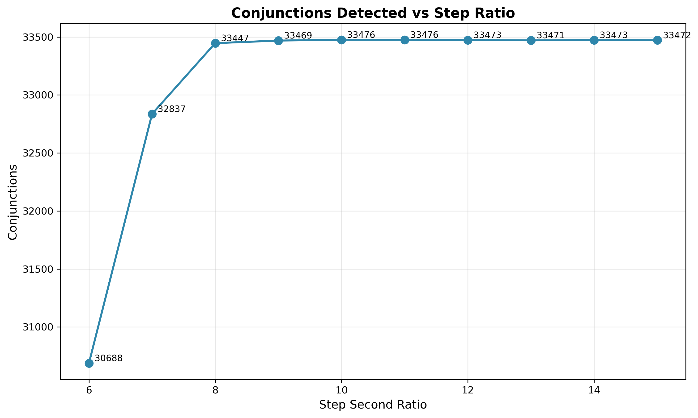

# Step Second Ratio Sweep

The step second ratio determines the coarse scan time step: `step_seconds = tolerance_km / ratio`. Higher ratio means
smaller steps (more SGP4 calls, slower). Lower ratio means larger steps (faster but high velocity conjunctions between
steps can be missed). With maximum relative velocity of 15 km/s between satellites, the theoretical safe step is
`tolerance_km / 15 km/s = 72 km / 15 km/s = 4.8 s` (ratio=15).

## Parameters

- **tolerance-km**: Fixed at 72 km
- **cell-ratio**: Fixed at 1.30
- **interpolation-stride**: Fixed at 5
- **lookahead-hours**: Fixed at 24
- **threshold-km**: Fixed at 5.0 km
- **step-second-ratio**: Swept 6-15
- **iterations**: 5 per configuration

## Results

| Ratio | Step (s) | Conjunctions | Accuracy | Loss  | Mean Time |
|-------|----------|--------------|----------|-------|-----------|
| 6     | 12.00    | 34,286       | 92.60%   | 7.40% | 47.9s     |
| 7     | 10.29    | 36,350       | 98.18%   | 1.82% | 56.9s     |
| 8     | 9.00     | 36,989       | 99.91%   | 0.09% | 61.9s     |
| 9     | 8.00     | 37,020       | 99.99%   | 0.01% | 72.7s     |
| 10    | 7.20     | 37,020       | 99.99%   | 0.01% | 78.4s     |
| 11    | 6.55     | 37,022       | 99.99%   | 0.01% | 88.0s     |
| 12    | 6.00     | 37,021       | 99.99%   | 0.01% | 92.4s     |
| 13    | 5.54     | 37,024       | 100.00%  | 0.00% | 100.9s    |
| 14    | 5.14     | 37,023       | 100.00%  | 0.00% | 105.8s    |
| 15    | 4.80     | 37,020       | 99.99%   | 0.01% | 119.4s    |

Ratio=9 and 15 detect practically the same amount of conjunctions. The extra resolution at ratio=15 costs 1.6x more time
for zero benefit.

## Recommended Values

- **Fast** (>= 98% accuracy): ratio = 7
- **Balanced** (>= 99.9% accuracy): ratio = 8
- **Conservative** (100% accuracy): ratio = 9
