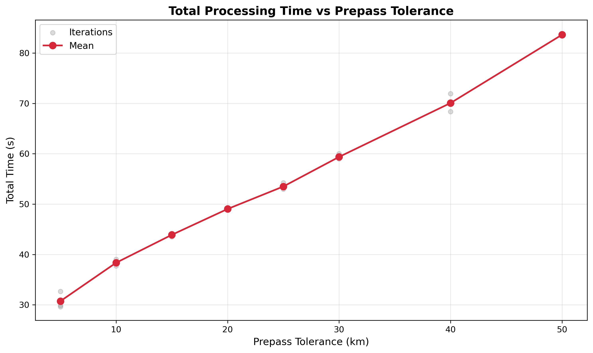
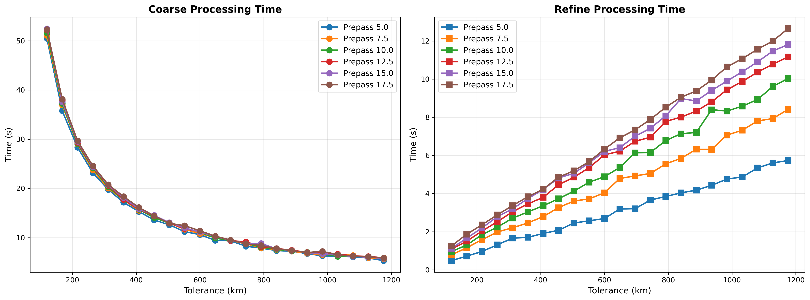
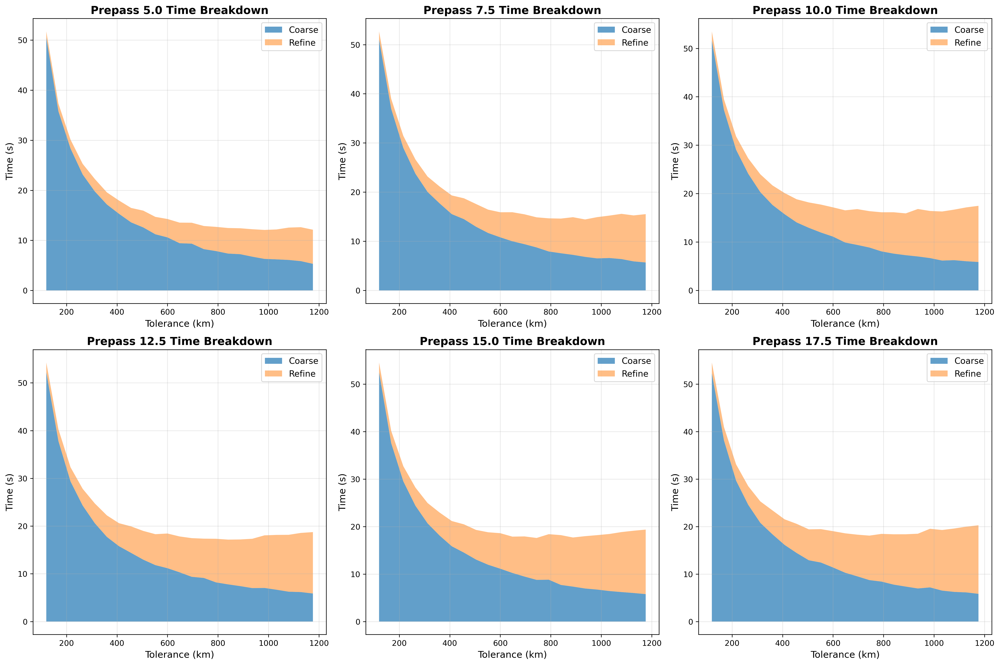
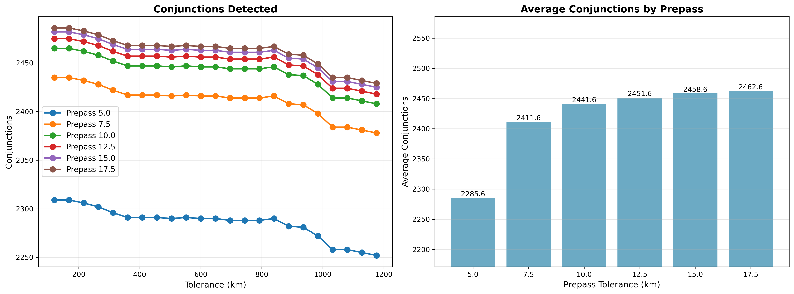

# Pre-pass Tolerance Tuning

The pair reduction filter uses a geometric tolerance to determine which satellite pairs could potentially collide. A
larger tolerance includes more pairs (safer but slower), while a smaller tolerance excludes more pairs (faster but risks
missing conjunctions).

This experiment finds the minimum pre-pass tolerance that detects all conjunctions.

## Parameters

- **prepass-tolerance-km**: Tolerance passed to pair reduction (swept from 2.5 to 20.0 km)
- **tolerance-km**: Coarse sweep detection threshold (swept from 120 to 1200 km)
- **step-second-ratio**: Fixed at 12
- **lookahead-hours**: Fixed at 24 hours
- **threshold-km**: Final conjunction threshold (fixed at 5.0 km)

## Analysis

### Conjunction Count by Prepass Tolerance

| Prepass (km) | Avg Dedup | Dedup Range   | Miss %   | Speed vs 17.5 |
|--------------|-----------|---------------|----------|---------------|
| 5.0          | 1160      | 1155-1162     | 13.2%    | +21.8%        |
| 7.5          | 1286      | 1281-1288     | 3.8%     | +13.1%        |
| **10.0**     | **1316**  | **1311-1318** | **1.6%** | **+8.4%**     |
| 12.5         | 1326      | 1321-1328     | 0.8%     | +4.1%         |
| 15.0         | 1333      | 1328-1335     | 0.3%     | +2.1%         |
| 17.5         | 1337      | 1332-1339     | 0.0%     | baseline      |

At prepass=5.0 km, we detect only ~1160 deduplicated conjunctions versus ~1337 at prepass=17.5 km. The pair reduction
filter is too aggressive and excludes satellite pairs that do have close approaches.

### Convergence Behavior

Conjunction count shows gradual convergence as pre-pass tolerance increases:

- **5.0 km**: 13.2% miss rate - unacceptable for operational use
- **7.5 km**: 3.8% miss rate - potentially useful for rapid screening, ~51 conjunctions missed
- **10.0 km**: 1.6% miss rate - good balance, only ~21 conjunctions missed, 8.4% faster
- **12.5 km**: 0.8% miss rate - high confidence, ~11 conjunctions missed, 4.1% faster
- **15.0+ km**: <0.5% miss rate - essentially complete coverage

## Conclusion

**Optimal pre-pass tolerance is 10.0 km (for 5.0 km conjunction threshold)**

This provides the best balance between detection completeness (98.4% accuracy) and performance (8.4% faster than full
convergence). For applications requiring near-complete coverage, use higher values.









## Running the Benchmark

```bash
# Run on Linux
./mvnw spring-boot:run -Dspring-boot.run.profiles=benchmark-conjunction

# Run on Windows
./mvnw spring-boot:run "-Dspring-boot.run.profiles=benchmark-conjunction"
```
