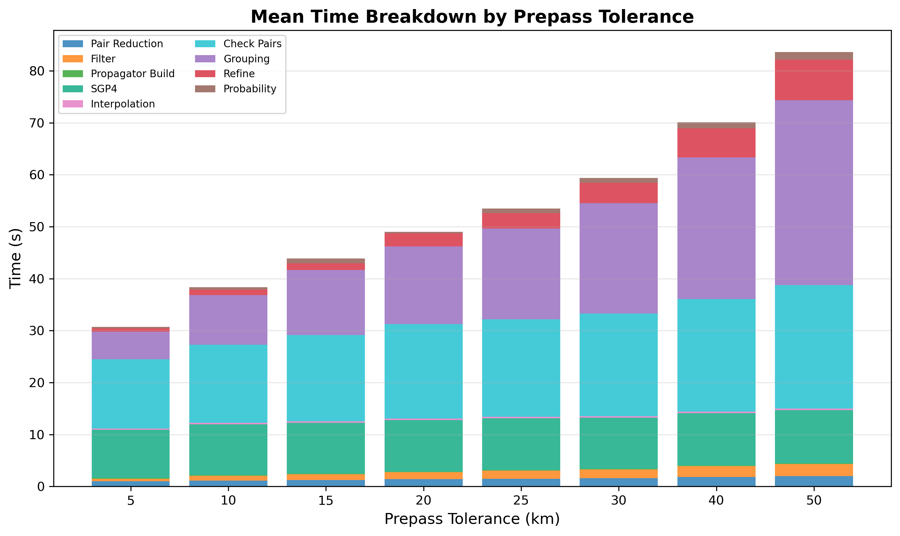
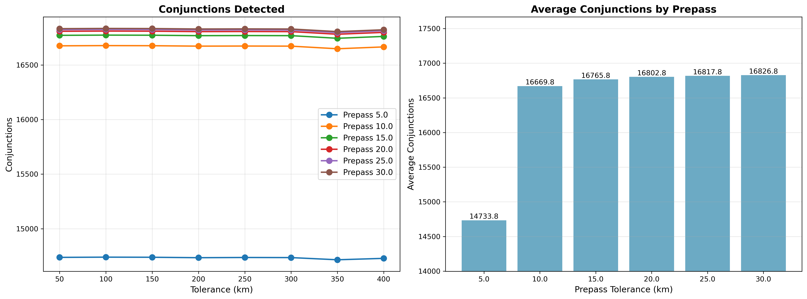

# Prepass Tolerance Sweep

The pair reduction "prepass" filter discards satellite pairs whose orbital parameters don't overlap within a tolerance
band. Higher tolerance keeps more pairs (slower but catches more edge cases). This experiment sweeps prepass tolerance
while locking all other parameters.

## Parameters

- **tolerance-km**: Fixed at 250 km
- **step-second-ratio**: Fixed at 10 (step = 25s)
- **interpolation-stride**: Fixed at 8
- **lookahead-hours**: Fixed at 24
- **threshold-km**: Fixed at 5.0 km
- **prepass-tolerance-km**: Swept {5, 10, 15, 20, 25, 30, 40, 50} km
- **iterations**: 3 per configuration

## Results

| Prepass (km) | Conjunctions | Accuracy | Loss   | Mean Time |
|--------------|--------------|----------|--------|-----------|
| 5            | 21,904       | 83.29%   | 16.71% | 30.7s     |
| 10           | 25,401       | 96.58%   | 3.42%  | 38.4s     |
| 15           | 25,711       | 97.76%   | 2.24%  | 43.9s     |
| 20           | 25,920       | 98.56%   | 1.44%  | 49.0s     |
| 25           | 26,037       | 99.00%   | 1.00%  | 53.5s     |
| 30           | 26,112       | 99.29%   | 0.71%  | 59.4s     |
| 40           | 26,229       | 99.73%   | 0.27%  | 70.1s     |
| 50           | 26,300       | 100.00%  | 0.00%  | 83.6s     |

## Recommended Values

- **Fast** (>= 97% accuracy): prepass = 10 km
- **Balanced** (>= 99% accuracy): prepass = 25 km
- **Conservative** (>= 99.7% accuracy): prepass = 40 km
