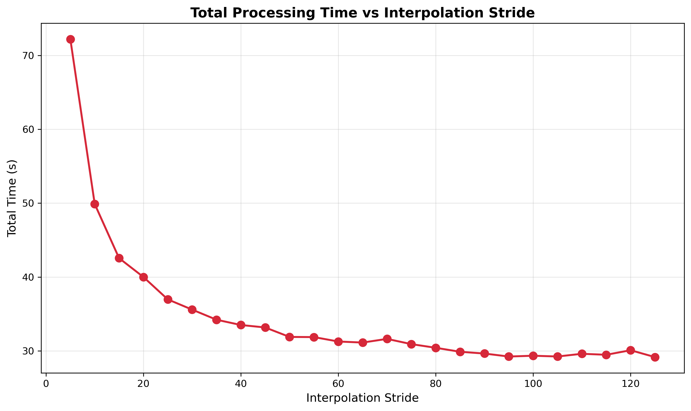
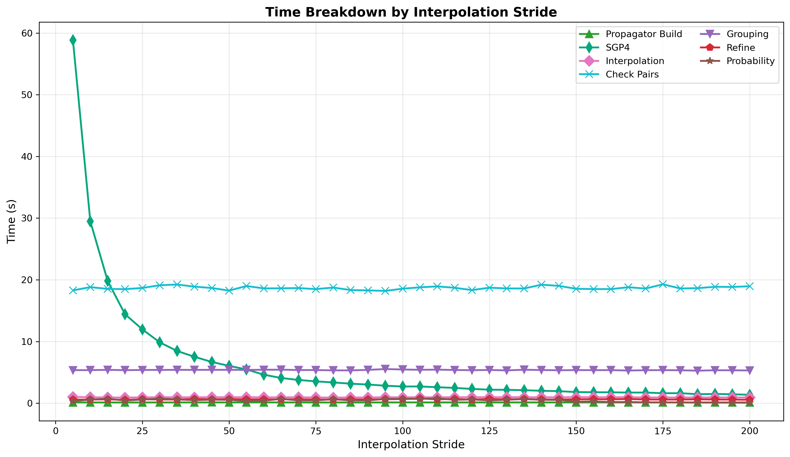
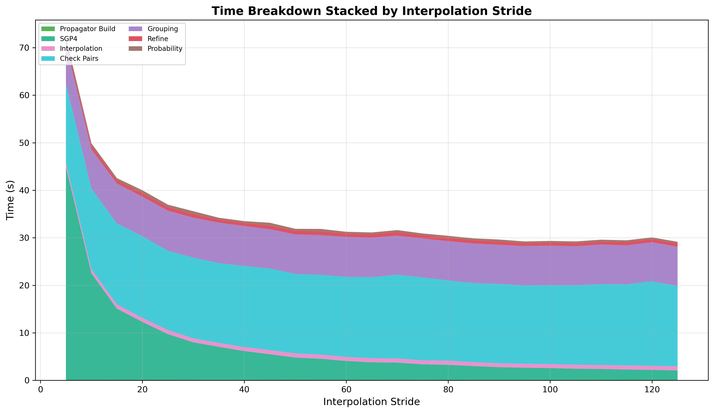

# Interpolation Stride Sweep

The interpolation stride controls how many coarse time steps share a single SGP4 call. At stride=1, every step gets a
real SGP4 propagation. At stride=N, SGP4 is called every N steps and intermediate positions are filled by cubic Hermite
interpolation using position + velocity at each knot point.

## Parameters

- **tolerance-km**: Fixed at 72 km
- **cell-ratio**: Fixed at 1.30
- **step-second-ratio**: Fixed at 10
- **lookahead-hours**: Fixed at 24
- **threshold-km**: Fixed at 5.0 km
- **interpolation-stride**: Swept 1-125
- **iterations**: 5 per configuration

## Results

Selected values:

| Stride | SGP4 Interval | Conjunctions | Accuracy | Loss  | Mean Time |
|--------|---------------|--------------|----------|-------|-----------|
| 1      | 7.20s         | 37,022       | 100.00%  | 0.00% | 282.2s    |
| 5      | 36.00s        | 37,020       | 99.99%   | 0.01% | 72.2s     |
| 10     | 72.00s        | 37,023       | 100.00%  | 0.00% | 49.9s     |
| 15     | 108.00s       | 37,021       | 100.00%  | 0.00% | 42.6s     |
| 20     | 144.00s       | 37,022       | 100.00%  | 0.00% | 40.0s     |
| 25     | 180.00s       | 37,018       | 99.99%   | 0.01% | 37.0s     |
| 30     | 216.00s       | 37,018       | 99.99%   | 0.01% | 35.6s     |
| 35     | 252.00s       | 36,916       | 99.71%   | 0.29% | 34.2s     |
| 40     | 288.00s       | 37,012       | 99.97%   | 0.03% | 33.5s     |
| 45     | 324.00s       | 36,902       | 99.68%   | 0.32% | 33.2s     |
| 50     | 360.00s       | 36,994       | 99.92%   | 0.08% | 31.9s     |
| 55     | 396.00s       | 36,941       | 99.78%   | 0.22% | 31.9s     |
| 60     | 432.00s       | 36,966       | 99.85%   | 0.15% | 31.3s     |
| 65     | 468.00s       | 36,790       | 99.37%   | 0.63% | 31.1s     |
| 70     | 504.00s       | 36,802       | 99.41%   | 0.59% | 31.6s     |
| 75     | 540.00s       | 36,832       | 99.49%   | 0.51% | 30.9s     |
| 80     | 576.00s       | 36,769       | 99.32%   | 0.68% | 30.4s     |
| 85     | 612.00s       | 36,594       | 98.84%   | 1.16% | 29.9s     |
| 90     | 648.00s       | 36,439       | 98.43%   | 1.57% | 29.6s     |
| 95     | 684.00s       | 36,232       | 97.87%   | 2.13% | 29.2s     |
| 100    | 720.00s       | 36,083       | 97.46%   | 2.54% | 29.3s     |

Speed gains flatten out around stride=50 as SGP4 time becomes negligible relative to check pairs and grouping. Accuracy
begins to degrade rapidly after stride=85.

