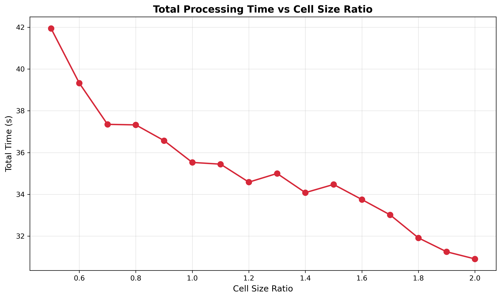
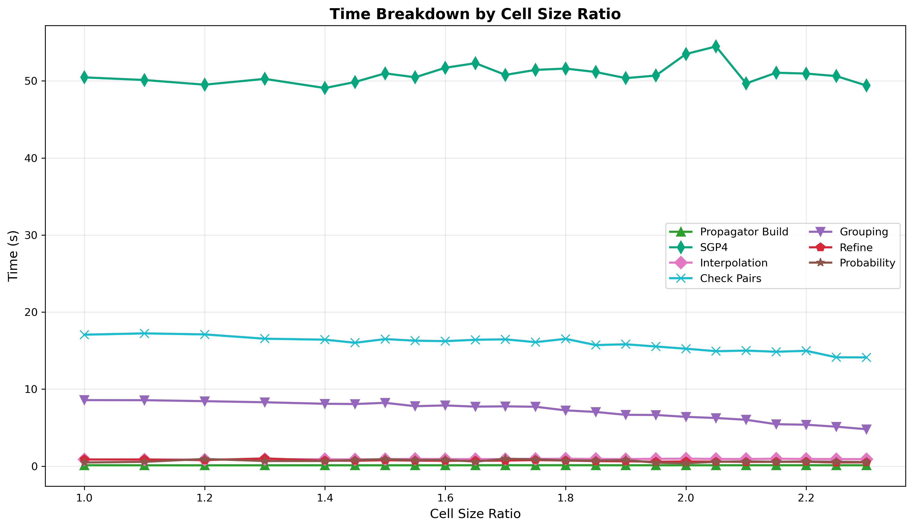
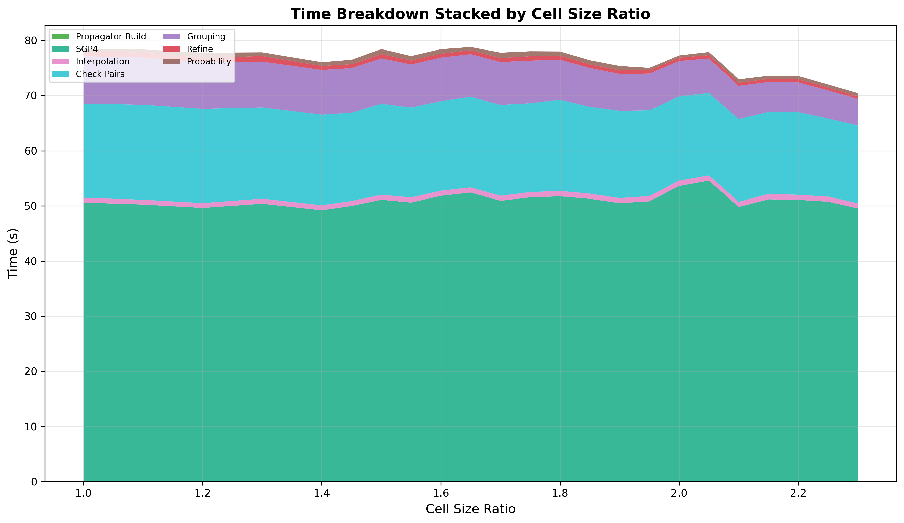
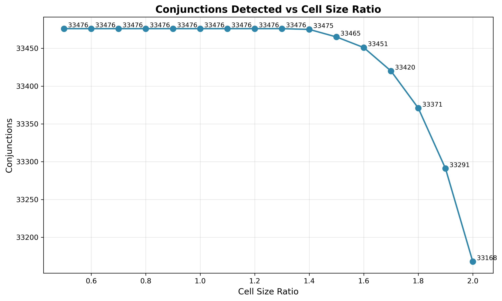

# Cell Size Ratio Sweep

The spatial grid divides 3D space into cubic cells for neighbor lookup. `cell_size_km = tolerance_km / cell_ratio`.
Smaller cells mean fewer satellites per cell, so each satellite has fewer candidates to check against. But
if cells are too small relative to the tolerance, two satellites within tolerance can end up in non-adjacent cells and
never get compared. The sweep finds where that tradeoff breaks.

## Parameters

- **tolerance-km**: Fixed at 72 km
- **step-second-ratio**: Fixed at 10
- **interpolation-stride**: Fixed at 5
- **lookahead-hours**: Fixed at 24
- **threshold-km**: Fixed at 5.0 km
- **cell-ratio**: Swept 1.0-2.3
- **iterations**: 5 per configuration

## Results

| Cell Ratio | Cell Size (km) | Conjunctions | Accuracy | Loss  | Mean Time | Check Time |
|------------|----------------|--------------|----------|-------|-----------|------------|
| 1.00       | 72.0           | 37,020       | 100.00%  | 0.00% | 78.5s     | 17.1s      |
| 1.10       | 65.5           | 37,020       | 100.00%  | 0.00% | 78.4s     | 17.2s      |
| 1.20       | 60.0           | 37,020       | 100.00%  | 0.00% | 77.8s     | 17.1s      |
| 1.30       | 55.4           | 37,020       | 100.00%  | 0.00% | 77.8s     | 16.5s      |
| 1.40       | 51.4           | 37,020       | 100.00%  | 0.00% | 76.0s     | 16.4s      |
| 1.45       | 49.7           | 37,017       | 99.99%   | 0.01% | 76.5s     | 16.0s      |
| 1.50       | 48.0           | 37,015       | 99.99%   | 0.01% | 78.4s     | 16.5s      |
| 1.55       | 46.5           | 37,015       | 99.99%   | 0.01% | 77.2s     | 16.3s      |
| 1.60       | 45.0           | 37,005       | 99.96%   | 0.04% | 78.4s     | 16.2s      |
| 1.65       | 43.6           | 36,995       | 99.93%   | 0.07% | 78.8s     | 16.4s      |
| 1.70       | 42.4           | 36,955       | 99.82%   | 0.18% | 77.8s     | 16.5s      |
| 1.75       | 41.1           | 36,942       | 99.79%   | 0.21% | 78.0s     | 16.1s      |
| 1.80       | 40.0           | 36,879       | 99.62%   | 0.38% | 78.0s     | 16.5s      |
| 1.85       | 38.9           | 36,877       | 99.61%   | 0.39% | 76.4s     | 15.7s      |
| 1.90       | 37.9           | 36,799       | 99.40%   | 0.60% | 75.4s     | 15.8s      |
| 1.95       | 36.9           | 36,754       | 99.28%   | 0.72% | 75.0s     | 15.5s      |
| 2.00       | 36.0           | 36,685       | 99.10%   | 0.90% | 77.3s     | 15.3s      |
| 2.05       | 35.1           | 36,633       | 98.95%   | 1.05% | 77.9s     | 14.9s      |
| 2.10       | 34.3           | 36,573       | 98.79%   | 1.21% | 73.0s     | 15.0s      |
| 2.15       | 33.5           | 36,468       | 98.51%   | 1.49% | 73.6s     | 14.9s      |
| 2.20       | 32.7           | 36,378       | 98.27%   | 1.73% | 73.6s     | 15.0s      |
| 2.25       | 32.0           | 36,265       | 97.96%   | 2.04% | 72.0s     | 14.1s      |
| 2.30       | 31.3           | 36,170       | 97.70%   | 2.30% | 70.4s     | 14.1s      |

Even at multiple iterations, mean time is too noisy to talk about significant performance gains that aren't attributed
to incorrectly missed conjunctions, but about 2 seconds can still be extracted on the check pairs stage when going from
ratio=1.0 to 1.6. Accuracy holds at 100% up to ratio=1.40 then degrades rapidly after ratio=1.6.

