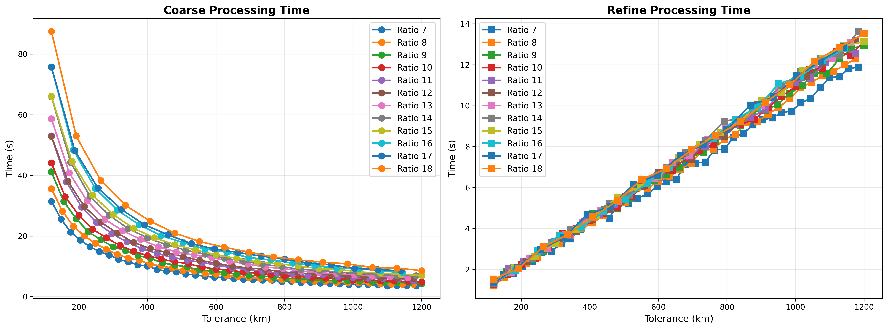
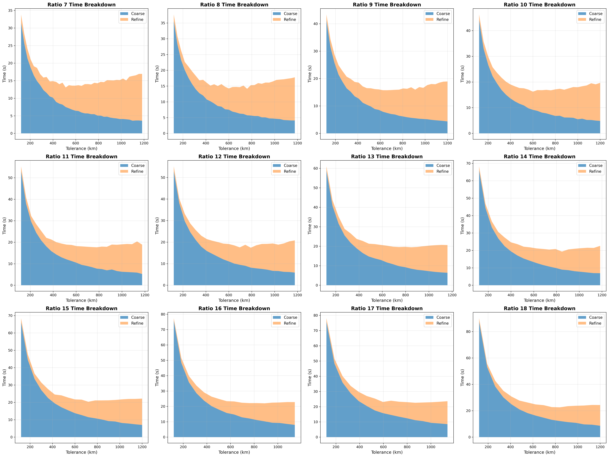
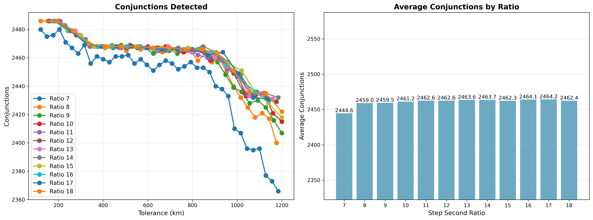

# Step Second Ratio Tuning

The coarse sweep samples satellite positions at fixed time intervals. The step size must be small enough that
fast-moving objects don't "skip over" each other between samples. With LEO satellites reaching relative velocities up
to ~15 km/s, the theoretical safe ratio is:

```
step_seconds = (int) (tolerance_km / 15)  // truncates to integer
```

This experiment tests whether different step sizes (ratios 7-18) affect detected conjunction count.

## Parameters

- **prepass-tolerance-km**: Fixed at 17.5 km (ensures prepass doesn't limit detection)
- **step-second-ratio**: Divides tolerance by this value to get step size (lower ratio = larger steps = fewer samples)
- **tolerance-km**: Coarse detection threshold (swept from 120 to 1200 km)
- **lookahead-hours**: Fixed at 24 hours
- **threshold-km**: Final conjunction threshold (fixed at 5.0 km)

## Analysis

### Convergence Behavior

Conjunction count shows **gradual convergence** as step ratio increases:

- **Ratio 7**: 0.9% miss rate - starts dropping conjunctions
- **Ratio 8-9**: 0.2% miss rate - good balance
- **Ratio 10-14**: 0.1% miss rate - near-complete detection
- **Ratio 14+**: no further benefit

### Performance vs Accuracy Trade-off

| Use Case       | Ratio | Miss Rate | Speed Gain |
|----------------|-------|-----------|------------|
| Fast screening | 8     | 0.2%      | +23.3%     |
| Balanced       | 10    | 0.1%      | +11.2%     |
| Conservative   | 11-14 | <0.1%     | baseline   |

Going beyond ratio 14 provides no detection benefit and only increases runtime.

## Conclusion

**Optimal step ratio is 10 for production use (0.1% miss, 11% faster)**

For aggressive screening, **ratio 8** provides 23% speed gain with only 0.2% miss rate (~3 conjunctions).

### Recommended Parameter Combinations

| Use Case        | Prepass | Ratio | Combined Miss | Speed vs Baseline |
|-----------------|---------|-------|---------------|-------------------|
| Production      | 12.5    | 10    | ~1.0%         | ~15% faster       |
| Fast screening  | 10.0    | 8     | ~1.7%         | ~23% faster       |
| Tight tolerance | 15.0    | 14    | ~0.3%         | baseline          |







