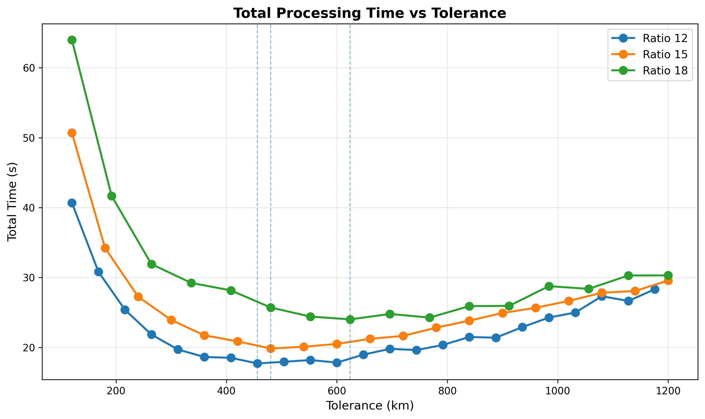
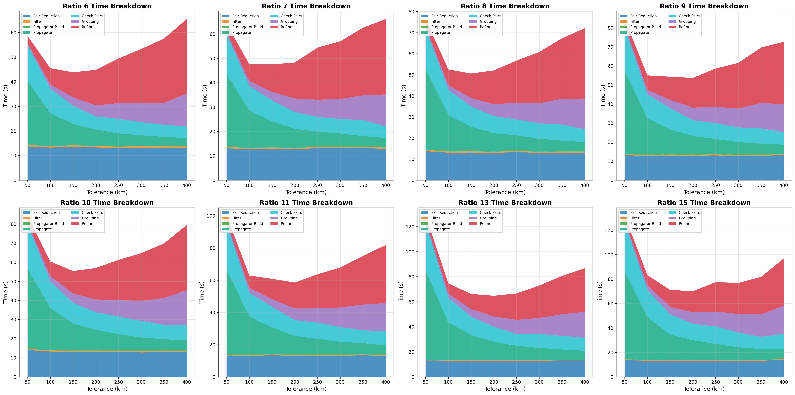
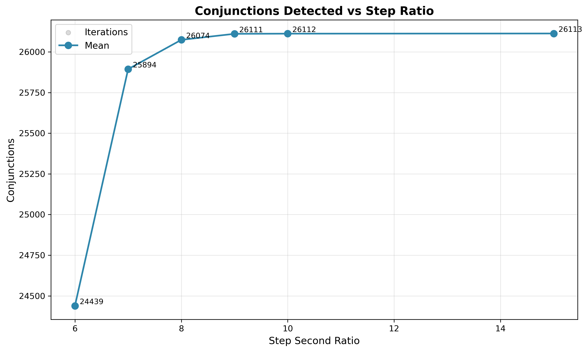

# Step Second Ratio Sweep

The step second ratio determines the coarse scan time step: `step_seconds = tolerance_km / ratio`. Higher ratio means
smaller steps (more SGP4 calls, slower). Lower ratio means larger steps (faster but high velocity conjunctions between
steps can be missed).

## Parameters

- **tolerance-km**: Fixed at 250 km
- **prepass-tolerance-km**: Fixed at 30 km
- **interpolation-stride**: Fixed at 8
- **lookahead-hours**: Fixed at 24
- **threshold-km**: Fixed at 5.0 km
- **step-second-ratio**: Swept {6, 7, 8, 9, 10, 15}
- **iterations**: 3 per configuration

## Results

| Ratio | Step (s) | Conjunctions | Accuracy | Loss  | Mean Time |
|-------|----------|--------------|----------|-------|-----------|
| 6     | 41       | 24,439       | 93.59%   | 6.41% | 39.8s     |
| 7     | 35       | 25,894       | 99.16%   | 0.84% | 45.6s     |
| 8     | 31       | 26,074       | 99.85%   | 0.15% | 49.7s     |
| 9     | 27       | 26,111       | 99.99%   | 0.01% | 55.8s     |
| 10    | 25       | 26,112       | 100.00%  | 0.00% | 58.9s     |
| 15    | 16       | 26,113       | 100.00%  | 0.00% | 88.4s     |

Ratio=10 and 15 detect identical conjunctions. The extra resolution at ratio=15 costs 1.5x more time for zero benefit.

## Recommended Values

- **Fast** (>= 99% accuracy): ratio = 7
- **Balanced** (>= 99.8% accuracy): ratio = 8
- **Conservative** (>= 99.99% accuracy): ratio = 9
