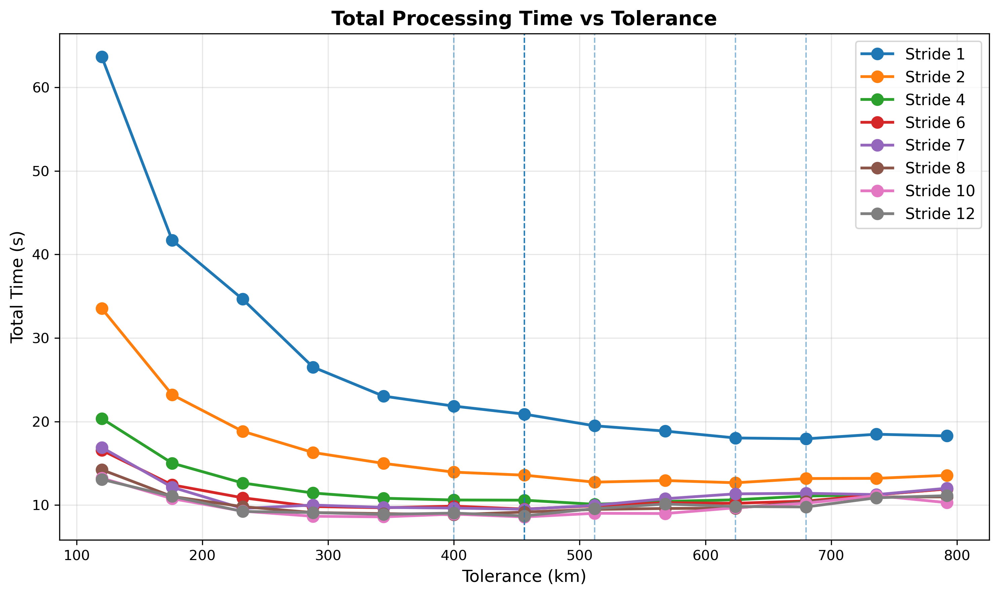
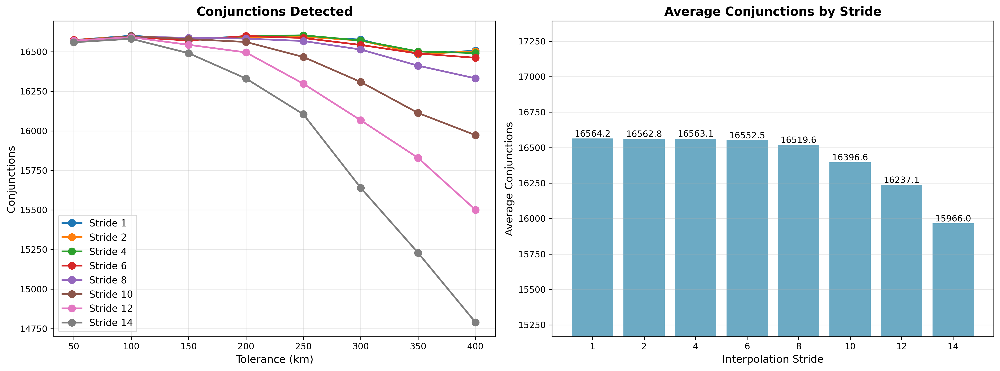

# Coarse Interpolation Stride Tuning

SGP4 propagation is the most expensive operation in the conjunction scanning pipeline. The `interpolation-stride`
parameter reduces SGP4 calls during the coarse sweep phase by computing positions only at select points and linearly
interpolating between them.

## Parameters

- **interpolation-stride**: Stride between SGP4 computations (tested: 1, 2, 4, 6, 8, 10, 12, 14)
    - `1` = all positions computed via SGP4 (no interpolation)
    - `6` = every 6th position is SGP4, 5/6 interpolated
- **prepass-tolerance-km**: Fixed at 10.0 km
- **step-second-ratio**: Fixed at 7
- **tolerance-km**: Swept from 50 to 400 km, incremented by 50
- **lookahead-hours**: Fixed at 24 hours
- **threshold-km**: Fixed at 5.0 km

## Analysis

### Speed vs Accuracy Trade-off

| Stride | Speed Gain | Miss Rate |
|--------|------------|-----------|
| 1      | baseline   | 0.24%     |
| 2      | +18.0%     | 0.25%     |
| 4      | +34.2%     | 0.25%     |
| 6      | +38.7%     | 0.31%     |
| 8      | +43.4%     | 0.51%     |
| 10     | +45.4%     | 1.25%     |
| 12     | +47.6%     | 2.21%     |
| 14     | +48.0%     | 3.84%     |

### Convergence Behavior

Interpolation error remains negligible up to stride 6, then degrades sharply:

- **Stride 1-4**: 99.75% accuracy - interpolation error negligible
- **Stride 6**: 99.69% accuracy - sweet spot, 38.7% faster
- **Stride 8-14**: Rapid degradation - miss rates increase exponentially

Going beyond stride 6 provides minimal speed gains (just 6.7% at stride 14) while accuracy drops from 99.69% to
96.16%.

## Conclusion

- **Quick scans**: Prepass 10 km + Ratio 7 + Stride 6 (98.02% accuracy, fast)
- **Complete detection**: Prepass >=15 km + Ratio 10 + Stride 4 (99.34% accuracy)






## Running the Benchmark

```bash
# Run on Linux
./mvnw spring-boot:run -Dspring-boot.run.profiles=benchmark-conjunction

# Run on Windows
./mvnw spring-boot:run "-Dspring-boot.run.profiles=benchmark-conjunction"

# *you must have a running PostgreSQL instance with the satellite catalog loaded, and orekit data files at src/main/resources/orekit-data
```
