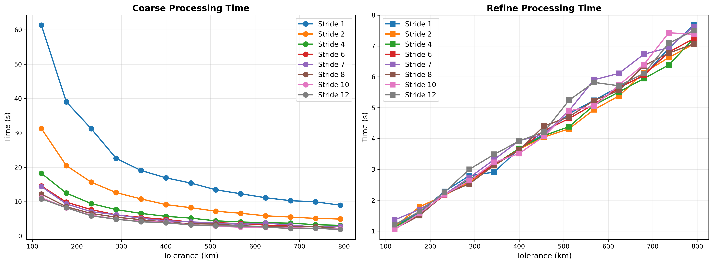
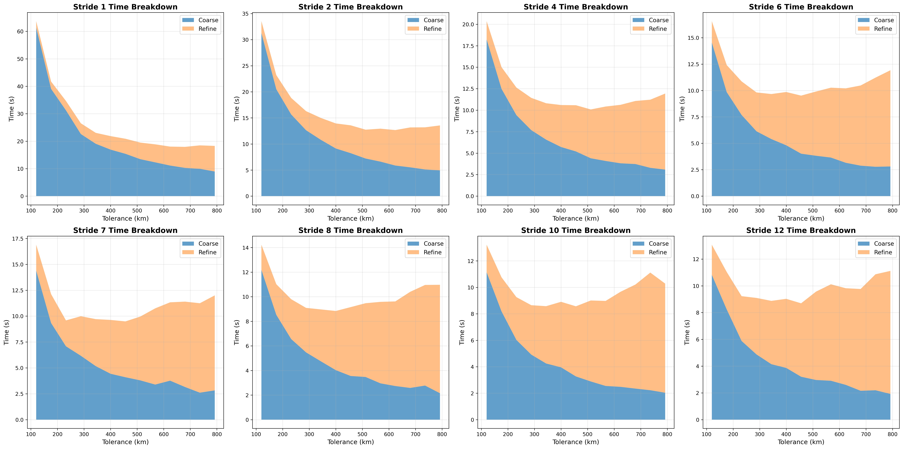
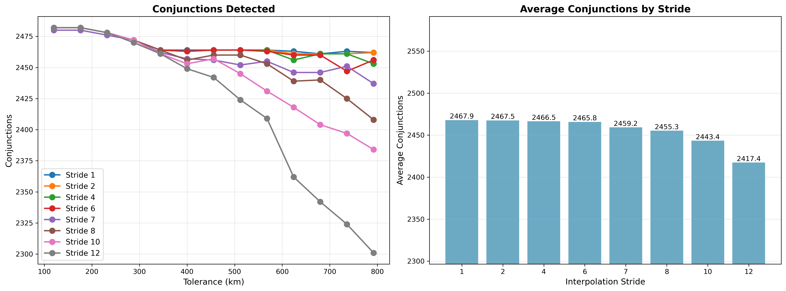

# Interpolation Stride Tuning

SGP4 propagation is the most expensive operation in the entire conjunction scanning pipeline. The `interpolation-stride`
parameter reduces SGP4 calls during the coarse sweep phase by computing positions only at select points and linearly
interpolating between them.

## Parameters

- **interpolation-stride**: Stride between SGP4 computations
    - `1` = all positions computed via SGP4 (no interpolation)
    - `2` = every 2nd position is SGP4, others linearly interpolated
    - `6` = every 6th position is SGP4, 5/6 interpolated
- **prepass-tolerance-km**: Fixed at 12.5 km
- **step-second-ratio**: Fixed at 12
- **tolerance-km**: Swept from 120 to 600 km
- **lookahead-hours**: Fixed at 6 hours
- **threshold-km**: Fixed at 5.0 km

## Results

Benchmark on 25% satellite sample (7,397 satellites). Selected data at tolerance=192 km.

| Stride | Coarse | Refine | Total | Conj | Dedup | SGP4 Reduction |
|--------|--------|--------|-------|------|-------|----------------|
| 1      | 8.07s  | 1.81s  | 10.8s | 226  | 206   | 0%             |
| 2      | 4.81s  | 1.91s  | 7.59s | 226  | 206   | 50%            |
| 4      | 2.83s  | 1.95s  | 5.59s | 227  | 207   | 75%            |
| 5      | 2.53s  | 1.79s  | 5.25s | 233  | 212   | 80%            |
| 6      | 2.19s  | 1.81s  | 4.89s | 227  | 207   | 83%            |
| 7      | 2.01s  | 1.76s  | 4.64s | 226  | 205   | 86%            |
| 8      | 1.89s  | 1.92s  | 4.64s | 222  | 202   | 88%            |
| 12     | 1.65s  | 1.91s  | 4.35s | 228  | 208   | 92%            |
| 16     | 1.50s  | 1.99s  | 4.36s | 226  | 205   | 94%            |

## Analysis

### Coarse Time Scaling

Coarse sweep time scales inversely with stride. At stride=6, coarse time is reduced by ~73% compared to stride=1.
The interpolation overhead (computing linear interpolations) is negligible compared to SGP4 savings.

### Conjunction Detection Accuracy

| Stride | Dedup Range | Status       |
|--------|-------------|--------------|
| 1      | 203-211     | Baseline     |
| 2      | 203-211     | Complete     |
| 4      | 202-212     | Complete     |
| 5      | 203-212     | Complete     |
| 6      | 202-211     | **Complete** |
| 7      | 201-212     | Missing ~1   |
| 8      | 198-209     | Missing ~3   |
| 12     | 196-210     | Missing ~5   |
| 16     | 182-206     | Missing ~15  |

At stride=7 and above, conjunction detection begins to degrade. Linear interpolation introduces position error
proportional to stride and orbital curvature. When the interpolated position deviates too far from reality, close
approaches can be missed during the coarse sweep.

## Conclusion

**Optimal interpolation stride is 6**

This reduces SGP4 calls by 83% while preserving all conjunction detections. Higher strides offer diminishing returns
(88% vs 83% at stride=8) while risking missed conjunctions.

