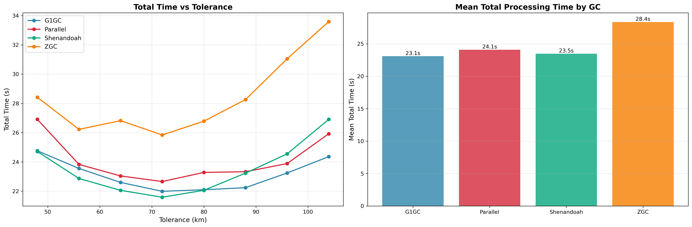
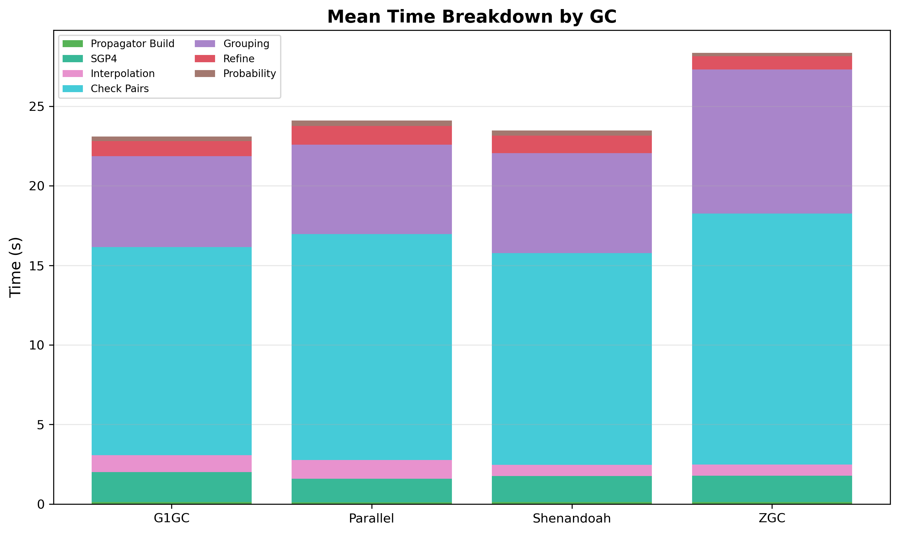
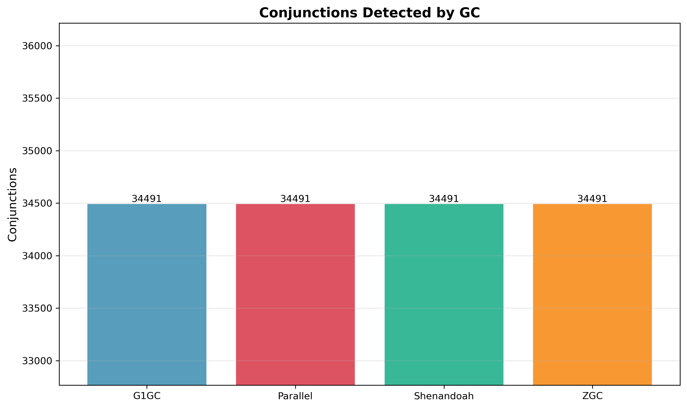

# Garbage Collector Comparison

Each GC runs the full conjunction pipeline across tolerance 48-96 km to capture how allocation pressure interacts with
collector strategy. Higher tolerance = more detections = more grouping allocations.

## Parameters

- **step-second-ratio**: Fixed at 8
- **interpolation-stride**: Fixed at 130
- **cell-ratio**: Fixed at 1.60
- **lookahead-hours**: Fixed at 24
- **threshold-km**: Fixed at 5.0 km
- **tolerance-km**: Swept {48, 56, 64, 72, 80, 88, 96, 104} km
- **iterations**: 5 per configuration
- **heap**: 10 GB (-Xmx10g -Xms10g -XX:+AlwaysPreTouch)

## Results

| GC         | Mean Time | Best Time | @ Tolerance | @ 64 km |
|------------|-----------|-----------|-------------|---------|
| G1GC       | 23.10s    | 21.99s    | 72 km       | 22.60s  |
| Shenandoah | 23.49s    | 21.59s    | 72 km       | 22.05s  |
| Parallel   | 24.11s    | 22.66s    | 72 km       | 23.04s  |
| ZGC        | 28.37s    | 25.84s    | 72 km       | 26.82s  |

All GCs detect identical conjunctions (35,062 @ 64 km). The difference is pure runtime.

Shenandoah has the lowest minimum (21.59s vs 21.99s for G1). ZGC is the slowest by far. Parallel is slightly worse than
G1.

**Recommendation: Shenandoah** (lowest minimum, meaning "daughter of the stars", very fitting)

