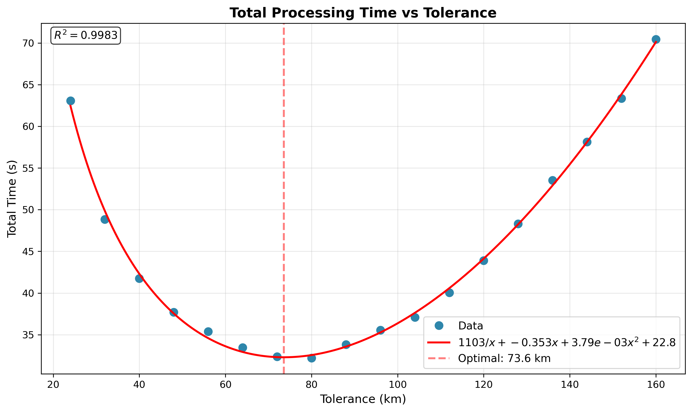
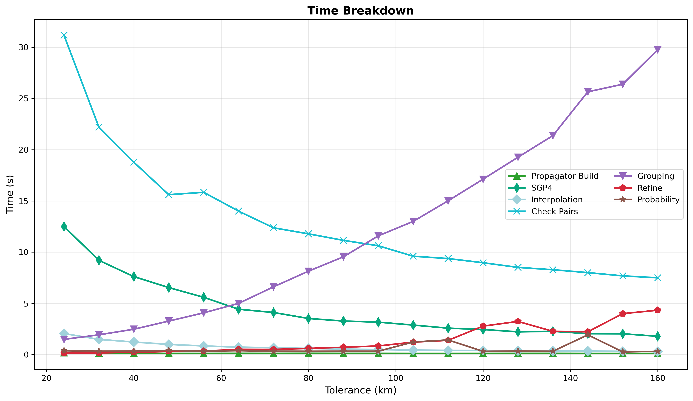
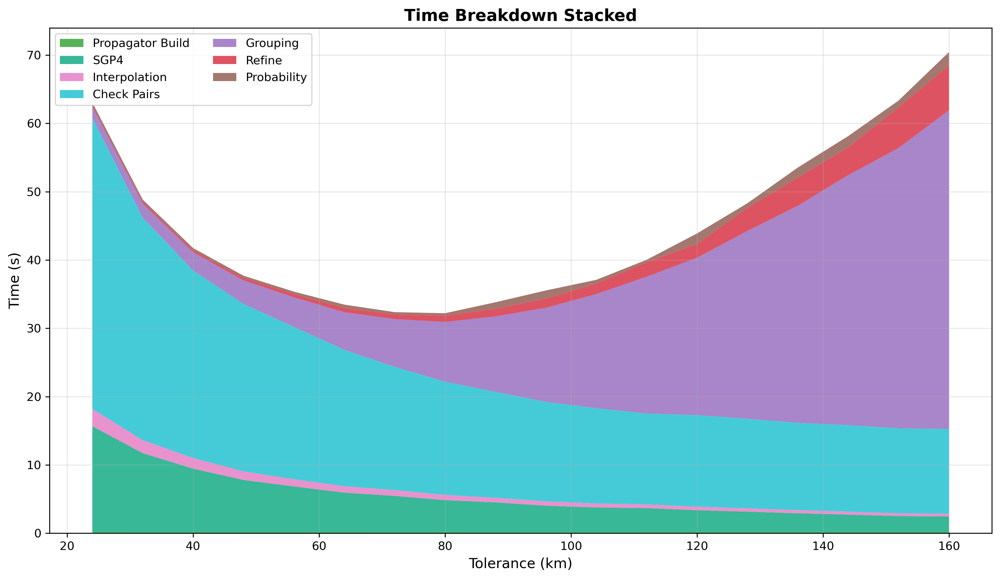
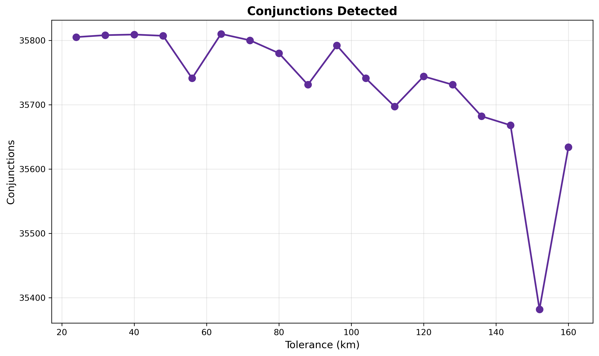

# Conjunction Tolerance Sweep

The tolerance parameter sets the coarse scan distance threshold AND determines the time step size via
`step_seconds = tolerance_km / step_ratio`. Larger tolerance means larger time steps (fewer SGP4 calls, cheaper
propagation) but more coarse detections to group. Smaller tolerance means finer time steps (more SGP4 calls) but fewer
detections. The optimum balances propagation cost against grouping cost.

## Parameters

- **step-second-ratio**: Fixed at 10
- **interpolation-stride**: Fixed at 50
- **cell-ratio**: Fixed at 1.30
- **lookahead-hours**: Fixed at 24
- **threshold-km**: Fixed at 5.0 km
- **tolerance-km**: Swept 24-160 km in steps of 8
- **iterations**: 5 per configuration

## Results

| Tolerance (km) | Conjunctions | Accuracy | Total Time |
|----------------|--------------|----------|------------|
| 24             | 35,805       | 99.99%   | 63.1s      |
| 40             | 35,809       | 100.00%  | 41.7s      |
| 64             | 35,810       | 100.00%  | 33.5s      |
| 72             | 35,800       | 99.97%   | 32.4s      |
| 80             | 35,780       | 99.92%   | 32.2s      |
| 96             | 35,792       | 99.95%   | 35.5s      |
| 128            | 35,731       | 99.78%   | 48.3s      |
| 160            | 35,634       | 99.51%   | 70.5s      |

Fit `a/x + bx + cx^2 + d` gives optimal at **73.6 km ~= 72 km** - the coarse and refine stages of the pipeline are
balanced.

Conjunction count is relatively stable across the sweep. Accuracy stays between 99.5% and 100% everywhere until
tolerance is set way above the optimal value.

