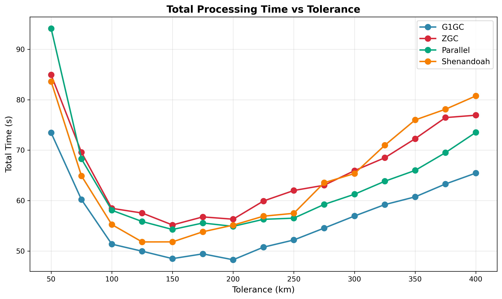
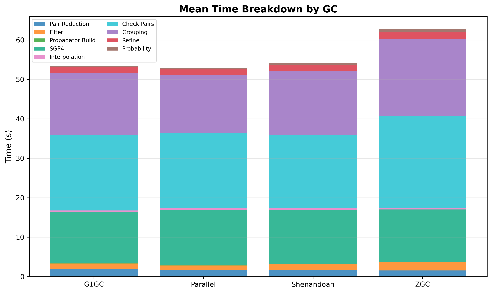
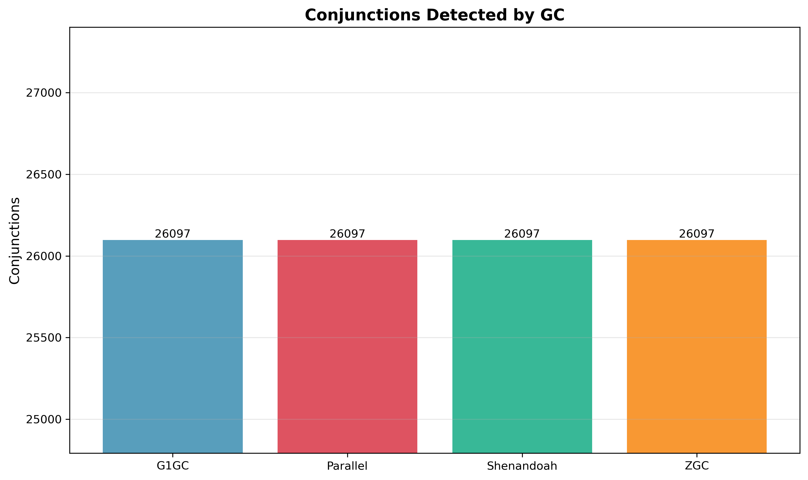

# Garbage Collector Comparison

Each GC runs the full conjunction pipeline across tolerance 100-300 km to capture how allocation pressure interacts with
collector strategy. Higher tolerance = more detections = more grouping allocations.

## Parameters

- **prepass-tolerance-km**: Fixed at 30 km
- **step-second-ratio**: Fixed at 10
- **interpolation-stride**: Fixed at 8
- **lookahead-hours**: Fixed at 24
- **threshold-km**: Fixed at 5.0 km
- **tolerance-km**: Swept 100-300 km (step 10 km)
- **heap**: 20 GB (-Xmx20g -Xms20g -XX:+AlwaysPreTouch)

## Results

| GC         | Best Time | @ Tolerance | @ 250 km | Optimal Range |
|------------|-----------|-------------|----------|---------------|
| Shenandoah | 48.6s     | 160 km      | 53.5s    | 140-200 km    |
| Parallel   | 49.8s     | 160 km      | 52.8s    | 150-210 km    |
| G1GC       | 50.5s     | 190 km      | 54.2s    | 170-250 km    |
| ZGC        | 55.7s     | 150 km      | 66.3s    | 130-190 km    |

All GCs detect identical conjunctions (26,112 @ 250 km). The difference is pure runtime.

Shenandoah has the fastest minimum (48.6s, 3.8% faster than G1). It falls off past ~250 km, and at 300 km it's 10%
slower than G1. It doesn't matter in practice because optimal tolerance is well within Shenandoah's sweet spot. G1 and
Parallel are within noise of each other. ZGC adds flat ~3-5s to check pairs at every tolerance level.

**Recommendation: Shenandoah** (meaning "daughter of the stars", very fitting for a satellite conjunction pipeline)

