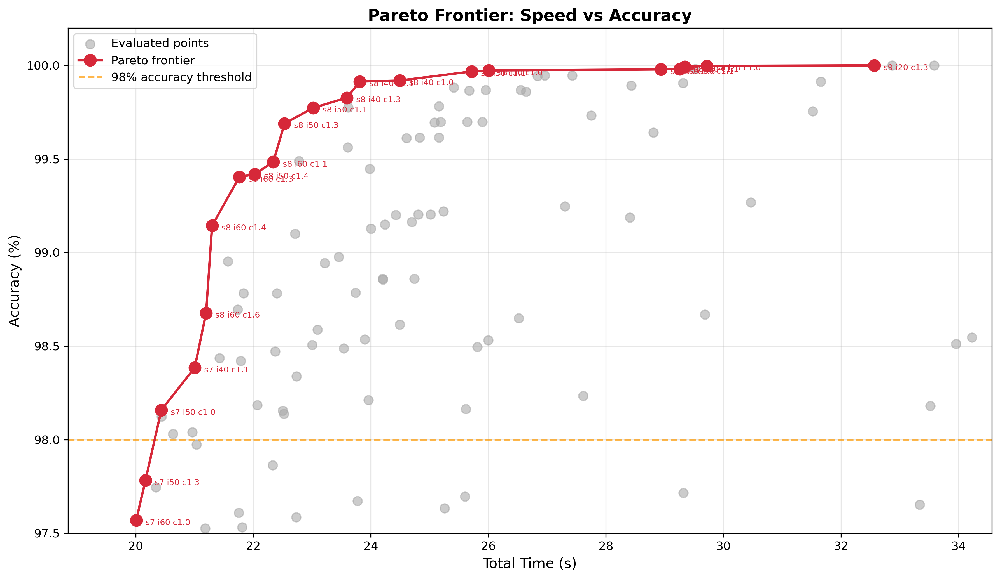
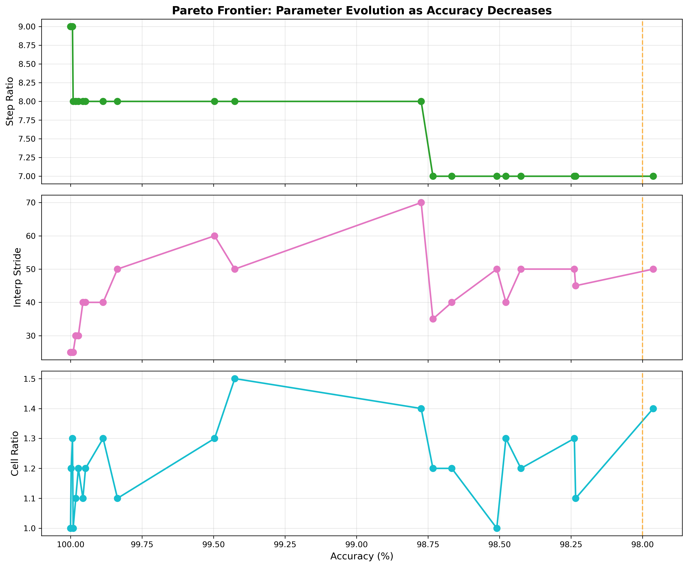

# Pareto Frontier: Speed vs Accuracy

The previous benchmarks (docs 1-3) swept one parameter at a time while holding the others at safe defaults. This
benchmark sweeps all three simultaneously using a bounded grid search to find the Pareto frontier of speed and accuracy.
The key finding is that picking the 99.9% accuracy option for each parameter individually does NOT produce 99.9%
accuracy when all three are shifted together. The losses interact and compound in unexpected ways.

## Parameters

- **tolerance-km**: Fixed at 72 km
- **lookahead-hours**: Fixed at 24
- **threshold-km**: Fixed at 5.0 km
- **step-second-ratio**: Swept from 9 down, delta 1
- **interpolation-stride**: Swept from 10 up, delta 10
- **cell-ratio**: Swept from 1.0 up, delta 0.15
- **iterations**: 2 per configuration, averaged

## Pareto Frontier

| Step | Stride | Cell | Cell (km) | Conj  | Accuracy | Time   |
|------|--------|------|-----------|-------|----------|--------|
| 9    | 20     | 1.30 | 55.4      | 37022 | 100.00%  | 39.53s |
| 8    | 20     | 1.00 | 72.0      | 37021 | 100.00%  | 35.42s |
| 9    | 30     | 1.15 | 62.6      | 37015 | 99.98%   | 33.40s |
| 8    | 30     | 1.00 | 72.0      | 37012 | 99.97%   | 31.56s |
| 8    | 30     | 1.15 | 62.6      | 37010 | 99.97%   | 31.32s |
| 8    | 40     | 1.00 | 72.0      | 36992 | 99.92%   | 29.55s |
| 8    | 40     | 1.15 | 62.6      | 36990 | 99.91%   | 29.33s |
| 8    | 40     | 1.30 | 55.4      | 36958 | 99.83%   | 28.60s |
| 8    | 50     | 1.00 | 72.0      | 36939 | 99.78%   | 28.31s |
| 8    | 50     | 1.30 | 55.4      | 36907 | 99.69%   | 27.45s |
| 8    | 50     | 1.45 | 49.7      | 36807 | 99.42%   | 27.31s |
| 8    | 60     | 1.30 | 55.4      | 36801 | 99.40%   | 27.09s |
| 8    | 60     | 1.45 | 49.7      | 36705 | 99.14%   | 26.89s |
| 8    | 70     | 1.30 | 55.4      | 36539 | 98.70%   | 26.58s |
| 8    | 60     | 1.60 | 45.0      | 36532 | 98.68%   | 26.25s |
| 8    | 70     | 1.45 | 49.7      | 36443 | 98.44%   | 26.23s |
| 7    | 40     | 1.00 | 72.0      | 36437 | 98.42%   | 26.17s |
| 7    | 40     | 1.15 | 62.6      | 36424 | 98.38%   | 26.13s |
| 7    | 50     | 1.00 | 72.0      | 36340 | 98.16%   | 25.61s |
| 7    | 50     | 1.15 | 62.6      | 36327 | 98.12%   | 25.09s |
| 7    | 50     | 1.30 | 55.4      | 36201 | 97.78%   | 24.95s |
| 7    | 60     | 1.00 | 72.0      | 36122 | 97.57%   | 24.80s |

These are the actual configurations to be considered for production use.

