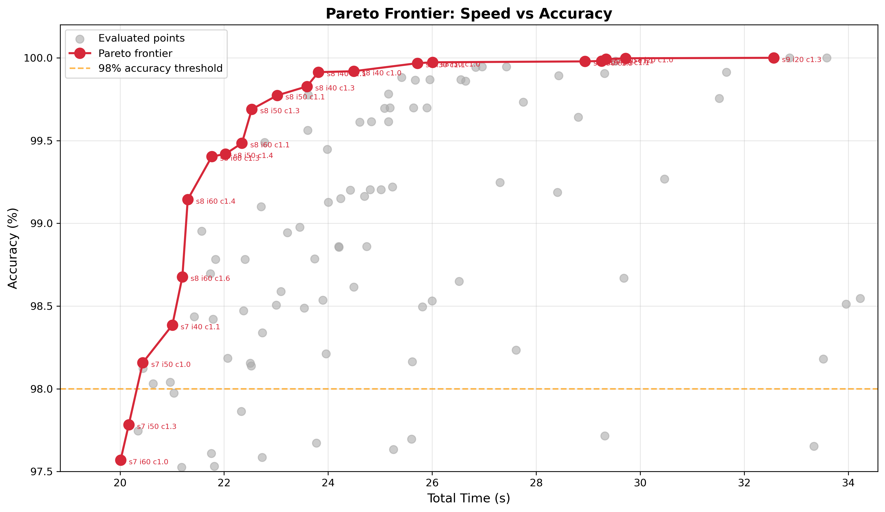
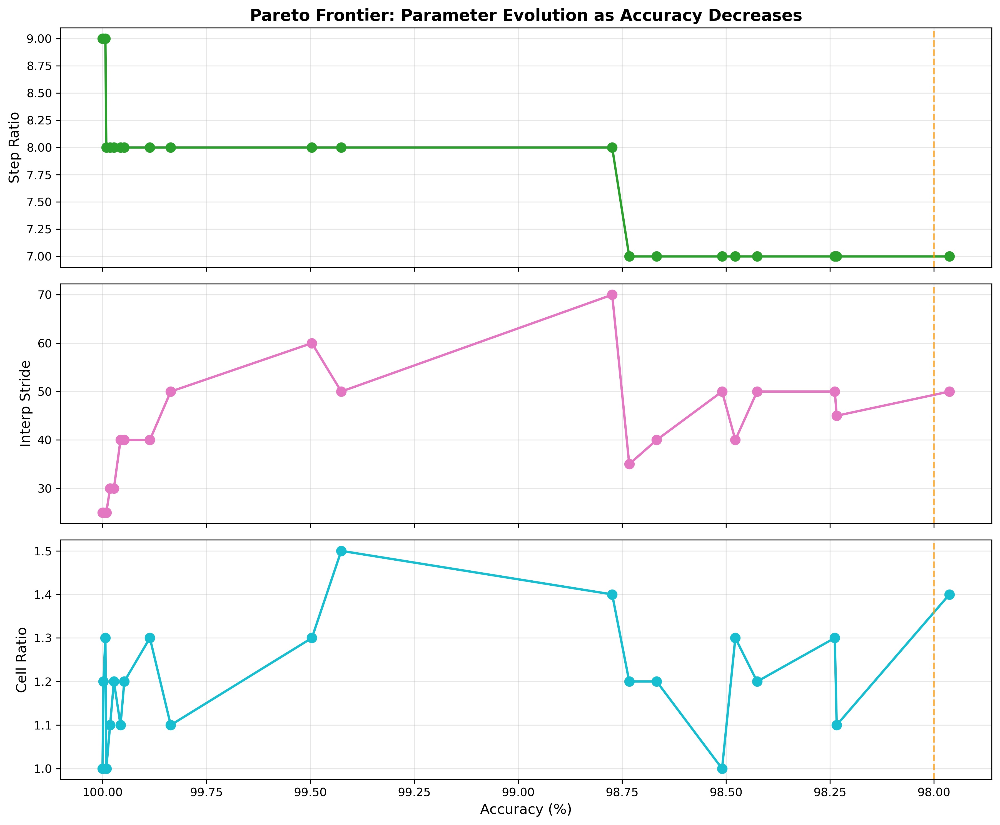
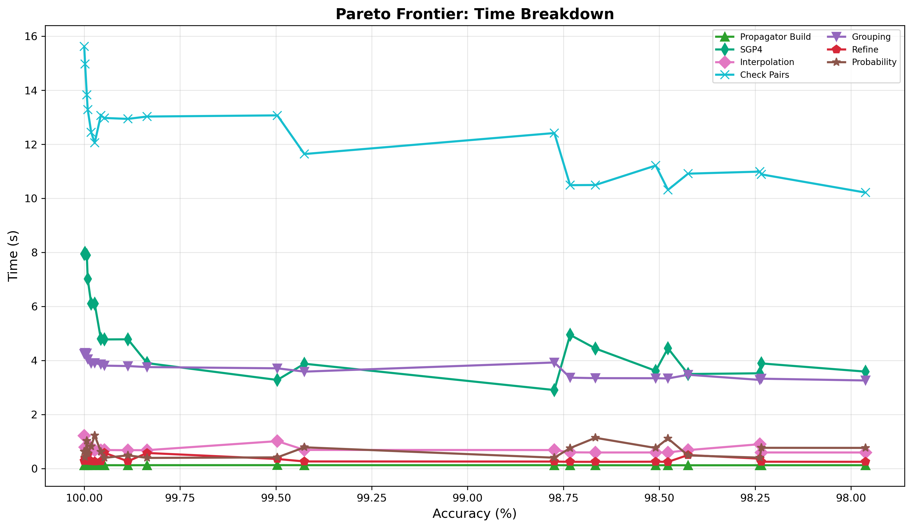
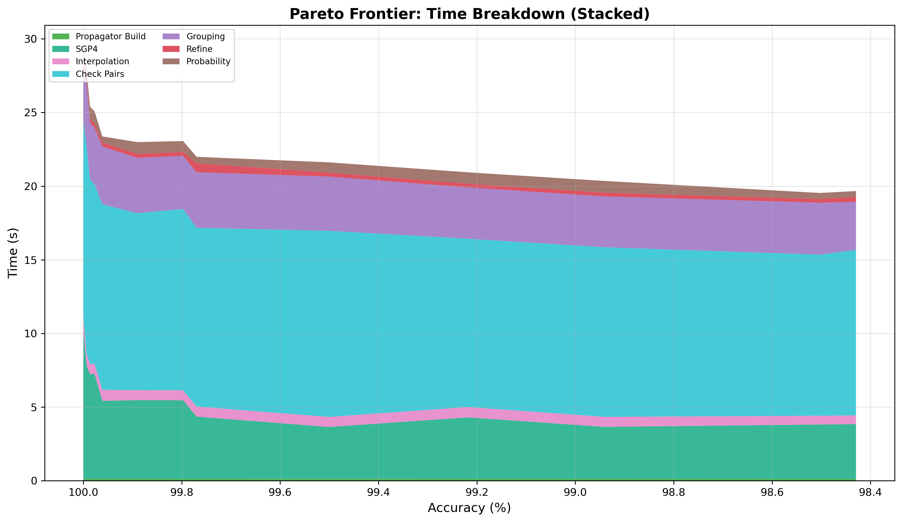

# Pareto Frontier: Speed vs Accuracy

The previous benchmarks (docs 1-3) swept one parameter at a time while holding the others at safe defaults. This
benchmark sweeps all three simultaneously using a bounded grid search to find the Pareto frontier of speed and accuracy.
The key finding is that picking the 99.9% accuracy option for each parameter individually does NOT produce 99.9%
accuracy when all three are changed together. The losses interact and compound in unexpected ways.

## Parameters

- **tolerance-km**: Fixed at 72 km
- **lookahead-hours**: Fixed at 24
- **threshold-km**: Fixed at 5.0 km
- **step-second-ratio**: Swept from 9 down, delta 1
- **interpolation-stride**: Swept from 10 up, delta 10
- **cell-ratio**: Swept from 1.0 up, delta 0.1
- **iterations**: 3 per configuration, median

## Pareto Frontier

| Step | Stride | Cell | Cell (km) | Conj  | Accuracy | Time   |
|------|--------|------|-----------|-------|----------|--------|
| 8    | 20     | 1.10 | 65.5      | 43872 | 100.00%  | 29.45s |
| 9    | 30     | 1.20 | 60.0      | 43868 | 99.99%   | 28.36s |
| 8    | 30     | 1.10 | 65.5      | 43865 | 99.99%   | 25.58s |
| 8    | 30     | 1.20 | 60.0      | 43861 | 99.98%   | 25.07s |
| 8    | 40     | 1.10 | 65.5      | 43854 | 99.96%   | 23.88s |
| 8    | 40     | 1.30 | 55.4      | 43823 | 99.89%   | 23.05s |
| 8    | 40     | 1.40 | 51.4      | 43782 | 99.80%   | 23.01s |
| 8    | 50     | 1.30 | 55.4      | 43770 | 99.77%   | 22.34s |
| 8    | 60     | 1.30 | 55.4      | 43652 | 99.50%   | 21.77s |
| 8    | 50     | 1.60 | 45.0      | 43528 | 99.22%   | 21.39s |
| 8    | 60     | 1.60 | 45.0      | 43406 | 98.94%   | 20.57s |
| 7    | 50     | 1.10 | 65.5      | 43214 | 98.50%   | 20.04s |
| 7    | 50     | 1.20 | 60.0      | 43182 | 98.43%   | 19.92s |

These are the actual configurations to be considered for production use.

