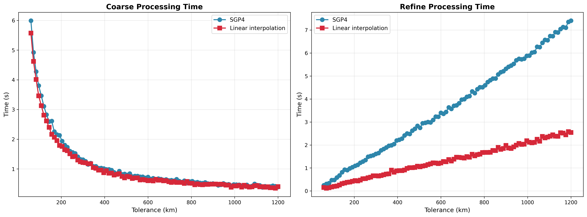
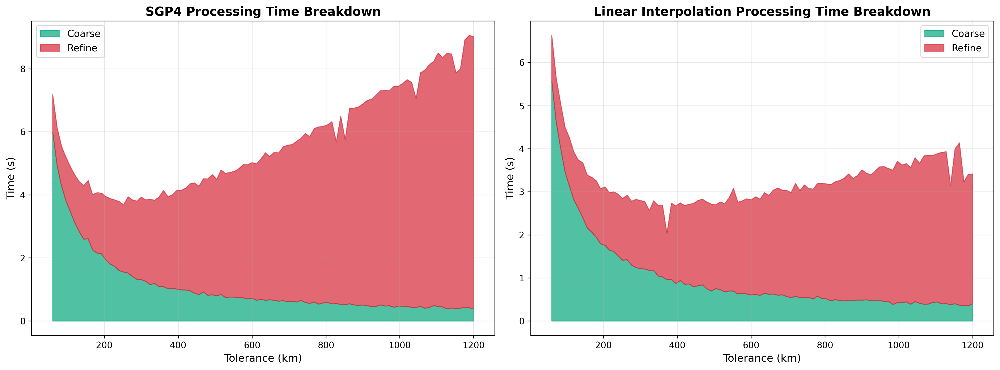

# Refinement Stage Linear Interpolation

The refinement stage uses Brent's method to find the precise TCA within each coarse detection window. Previously, each
Brent evaluation called SGP4 propagation for both satellites. This experiment replaces SGP4 calls during optimization
with linear interpolation, only using SGP4 for the final distance measurement.

The refinement window is +-stepSeconds/2 around the best coarse detection (~19 seconds total). At this timescale, linear
interpolation error is ~380m worst-case, well under the 5km threshold.

## Parameters

- **prepass-tolerance-km**: Fixed at 12.5 km
- **step-second-ratio**: Fixed at 12
- **interpolation-stride**: Fixed at 6
- **tolerance-km**: Swept from 60 to 1200 km
- **lookahead-hours**: Fixed at 6 hours
- **threshold-km**: Fixed at 5.0 km

## Results

Benchmark on 25% satellite sample (7,397 satellites). Selected data points.

| Tol (km) | Refine (SGP4) | Refine (Interp) | Speedup | Total (SGP4) | Total (Interp) |
|----------|---------------|-----------------|---------|--------------|----------------|
| 60       | 0.25s         | 0.15s           | 1.6x    | 7.18s        | 6.63s          |
| 120      | 0.58s         | 0.21s           | 2.8x    | 4.63s        | 3.92s          |
| 228      | 1.23s         | 0.47s           | 2.6x    | 3.84s        | 3.00s          |
| 360      | 1.96s         | 0.75s           | 2.6x    | 4.14s        | 2.68s          |
| 600      | 3.40s         | 1.22s           | 2.8x    | 5.02s        | 2.81s          |
| 900      | 5.31s         | 1.98s           | 2.7x    | 6.89s        | 3.51s          |
| 1200     | 7.41s         | 2.54s           | 2.9x    | 9.02s        | 3.41s          |

## Analysis

### Refinement Time Reduced by 2-3x

Linear interpolation reduces refinement time consistently across all tolerance values. The speedup comes from replacing
expensive SGP4 propagations with simple linear math during Brent's optimization loop.

### Optimal Tolerance Shifts Higher

With cheaper refinement, higher tolerances become more attractive. The interpolation curve stays flatter, with the
minimum shifting from ~228km to ~300km range.

### Conjunction Detection

| Method        | Avg Conjunctions | Avg Deduplicated |
|---------------|------------------|------------------|
| SGP4          | 222              | 202              |
| Interpolation | 220              | 200              |

The ~1% difference is threshold boundary noise. Conjunctions hovering at 4.9-5.1km may land on either side depending on
the exact TCA found. The final distance is still measured with full SGP4 precision.

## Conclusion

**Linear interpolation in the refinement stage reduces refinement time by ~2.7x with negligible accuracy impact.**

At optimal tolerances, total processing time improves by ~22%. Since the final TCA distance is still computed with SGP4,
there's little to no loss of precision in the final conjunction data.
