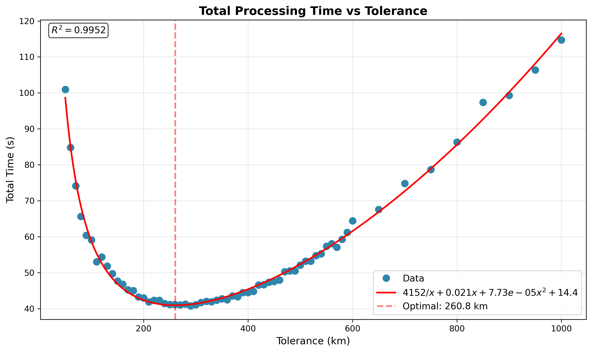
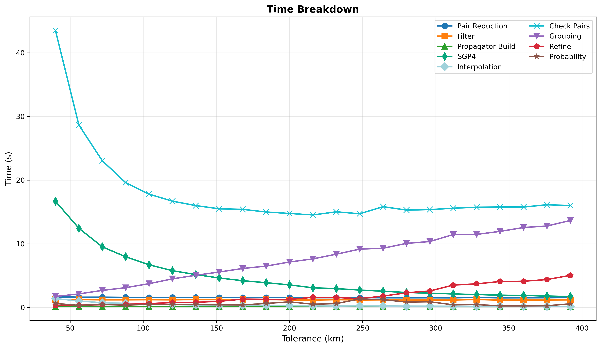
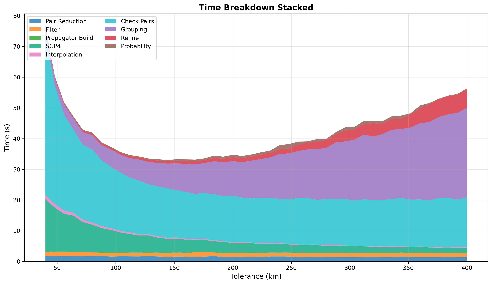
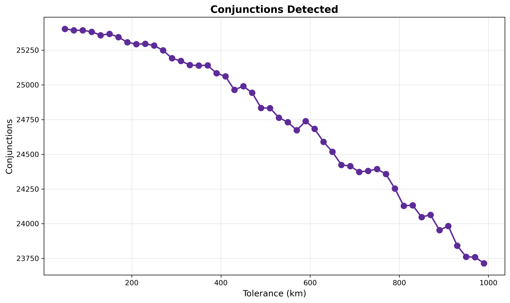

# Conjunction Tolerance Sweep

The tolerance parameter sets the coarse scan distance threshold AND determines the time step size via
`step_seconds = tolerance_km / step_ratio`. Larger tolerance means larger time steps (fewer SGP4 calls, cheaper
propagation) but more coarse detections to group. Smaller tolerance means finer time steps (more SGP4 calls) but fewer
detections. The optimum balances propagation cost against grouping cost.

## Parameters

- **prepass-tolerance-km**: Fixed at 25 km
- **step-second-ratio**: Fixed at 8
- **interpolation-stride**: Fixed at 24
- **lookahead-hours**: Fixed at 24
- **threshold-km**: Fixed at 5.0 km
- **tolerance-km**: Swept 40-400 km (step 8 km)
- **iterations**: 1 per configuration

## Results

Total time bottoms out around 150 km then rises steadily as grouping cost dominates. SGP4 cost
drops with larger tolerance (fewer time steps) but grouping grows faster than SGP4 shrinks.

Optimum is **152 km** - the coarse and refine stages of the pipeline are balanced.

