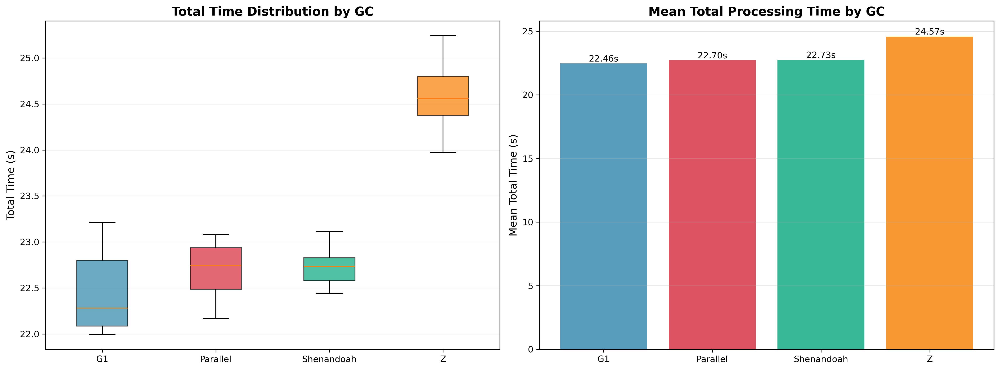
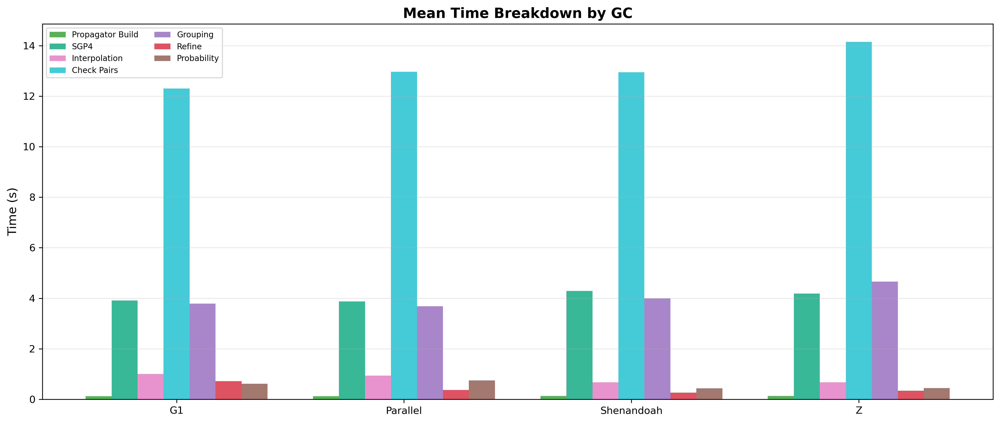

# Garbage Collector Comparison

Each GC runs the same fixed-parameter conjunction pipeline 10 times to measure throughput variance.

## Parameters

- **tolerance-km**: Fixed at 72 km
- **step-second-ratio**: Fixed at 8
- **interpolation-stride**: Fixed at 50
- **cell-ratio**: Fixed at 1.30
- **lookahead-hours**: Fixed at 24
- **threshold-km**: Fixed at 5.0 km
- **iterations**: 10 per GC
- **heap**: 12 GB (-Xmx12g -Xms12g -XX:+AlwaysPreTouch)

## Results

| GC         | Mean Time | Std Dev | Min    | Max    | Conjunctions |
|------------|-----------|---------|--------|--------|--------------|
| G1         | 29.89s    | 0.45s   | 29.20s | 30.56s | 36907        |
| Parallel   | 29.87s    | 0.60s   | 29.08s | 30.70s | 36907        |
| Shenandoah | 30.39s    | 0.39s   | 29.93s | 31.19s | 36907        |
| Z          | 33.12s    | 0.59s   | 32.33s | 33.94s | 36907        |

All GCs detect identical conjunctions (36,907). The difference is pure runtime.

G1 and Parallel are tied, but Parallel isn't suitable for a web backend. Shenandoah is ~1.7% slower. ZGC is the slowest
by a significant margin.

**Recommendation: G1.**

