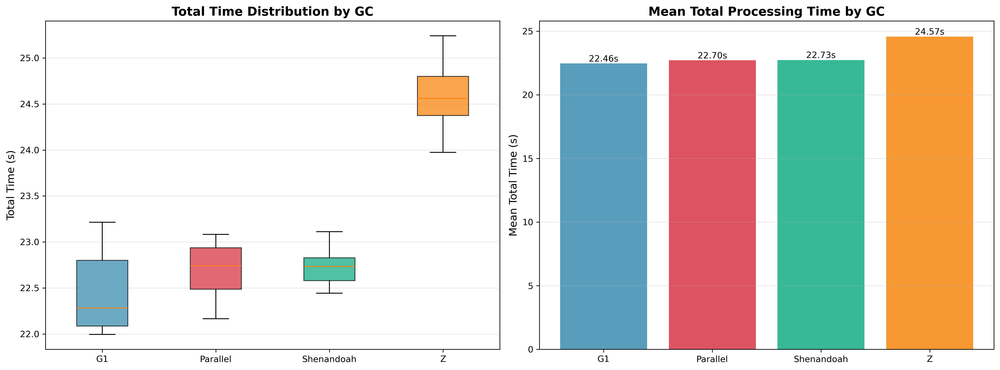
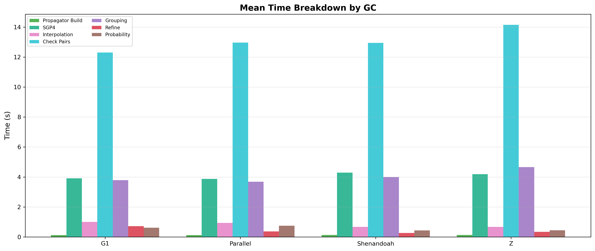

# Garbage Collector Comparison

Each GC runs the same fixed-parameter conjunction pipeline 10 times to measure throughput variance.

## Parameters

- **tolerance-km**: Fixed at 72 km
- **step-second-ratio**: Fixed at 8
- **interpolation-stride**: Fixed at 50
- **cell-ratio**: Fixed at 1.30
- **lookahead-hours**: Fixed at 24
- **threshold-km**: Fixed at 5.0 km
- **iterations**: 10 per GC
- **heap**: 12 GB (-Xmx12g -Xms12g -XX:+AlwaysPreTouch)

## Results

| GC         | Mean Time | Std Dev | Min    | Max    | Conjunctions |
|------------|-----------|---------|--------|--------|--------------|
| G1         | 22.46s    | 0.47s   | 22.00s | 23.21s | 43770        |
| Parallel   | 22.70s    | 0.30s   | 22.17s | 23.08s | 43770        |
| Shenandoah | 22.73s    | 0.22s   | 22.44s | 23.11s | 43770        |
| Z          | 24.57s    | 0.37s   | 23.97s | 25.24s | 43770        |

All GCs detect identical conjunctions (43,770). The difference is pure runtime.

G1, Parallel, and Shenandoah are effectively tied (~1% spread). ZGC is ~9% slower.

**Recommendation: G1.**

