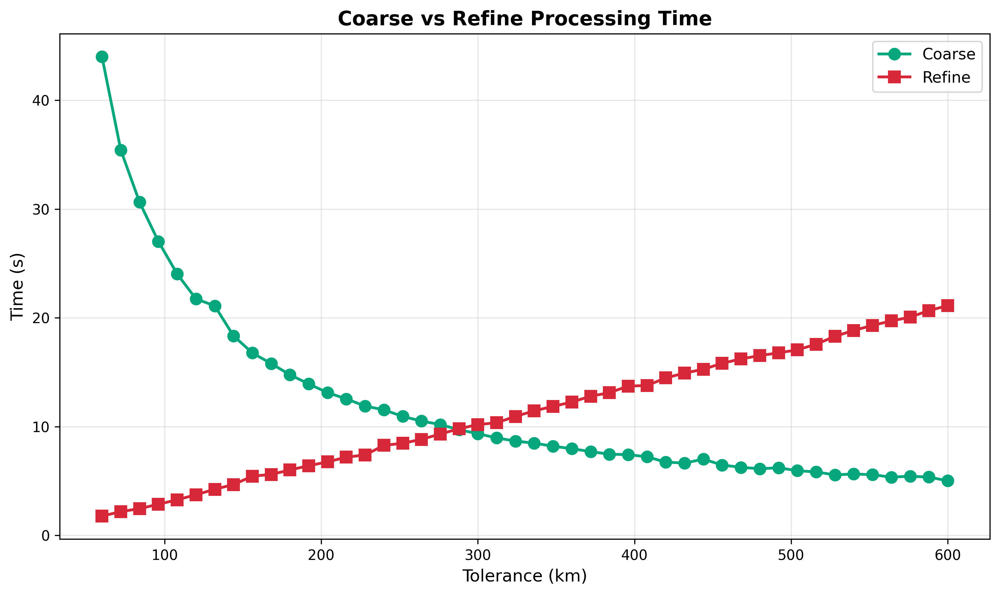
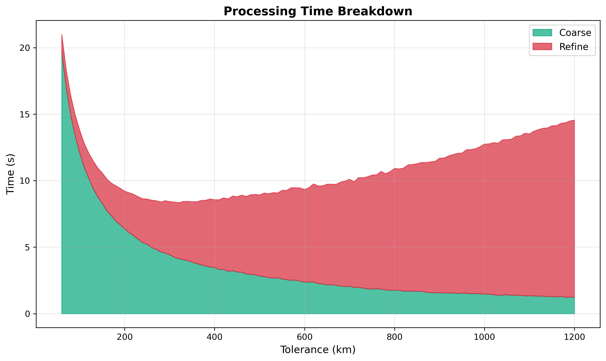

# Conjunction Tolerance Tuning

Final tuning of the coarse sweep tolerance parameter, with prepass, step ratio, and interpolation already optimized.

## Parameters

- **prepass-tolerance-km**: Fixed at 12.5 km (from prepass tuning)
- **step-second-ratio**: Fixed at 12 (from step ratio tuning)
- **interpolation-stride**: Fixed at 6 (from interpolation tuning)
- **tolerance-km**: Coarse detection threshold (swept from 60 to 1200 km in steps of 12)
- **lookahead-hours**: Fixed at 6 hours
- **threshold-km**: Final conjunction threshold (fixed at 5.0 km)

## Analysis

### Time Complexity Trade-off

The coarse and refine stages have opposing time complexities with respect to tolerance:

- **Coarse time - O(1/tolerance)**: Larger tolerance means larger step size, so fewer propagation calls. Doubling
  tolerance roughly halves coarse time.
- **Refine time - O(tolerance)**: Larger tolerance catches more events that need refinement.

Since total time = coarse + refine + negligible overhead, the optimal tolerance minimizes this sum. As tolerance
increases, coarse time decreases but refine time increases. The U-shaped total time curve has its minimum where these
opposing effects balance.

### Performance Curve

| Tolerance Range | Dominant Stage | Behavior                                 |
|-----------------|----------------|------------------------------------------|
| under 200 km    | Coarse         | Many time steps, few events to refine    |
| 200-300 km      | **Balanced**   | Minimum total time                       |
| 300+ km         | Refine         | Fewer coarse steps, many false positives |

### Conjunction Stability

Configurations up to ~600 km detect similar amount of deduplicated conjunctions consistently. Above 600 km, detection
begins to drop off slightly. This is likely due to interpolation error at stride=6 compounding with large step sizes,
but it's irrelevant in practice since optimal tolerance is well below this range.

## Conclusion

**Optimal tolerance is 240 km with step size of 20s**

The optimal tolerance is where coarse and refine times are balanced. Going lower wastes time on excessive coarse
iterations; going higher wastes time refining too many false positives.

