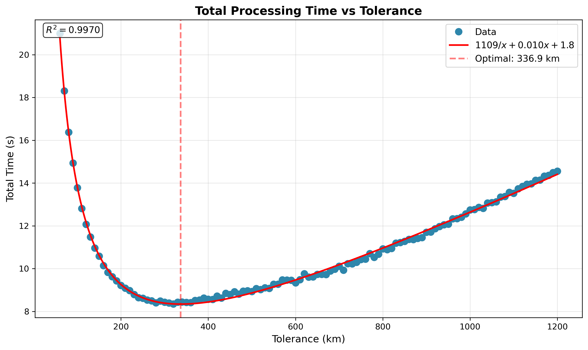
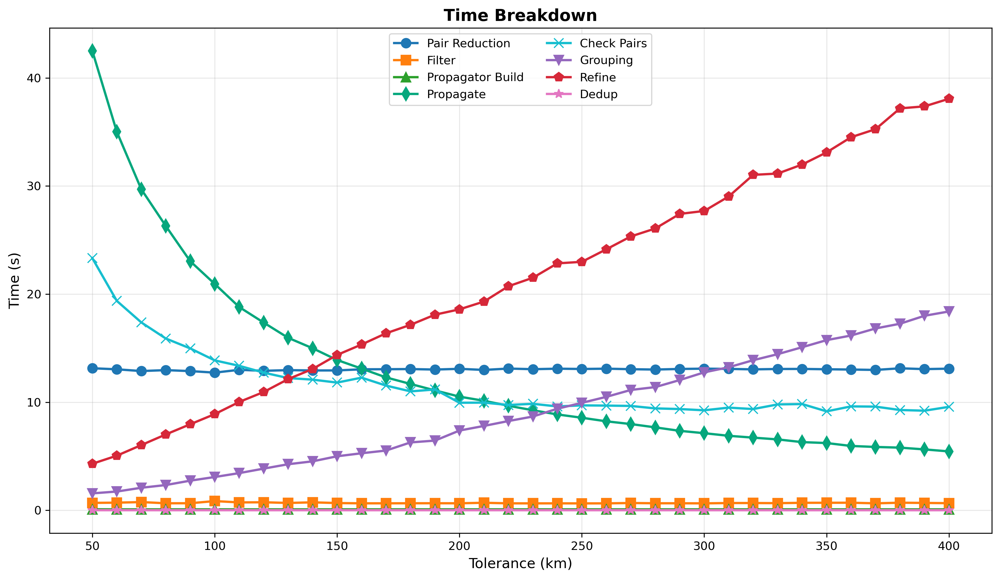
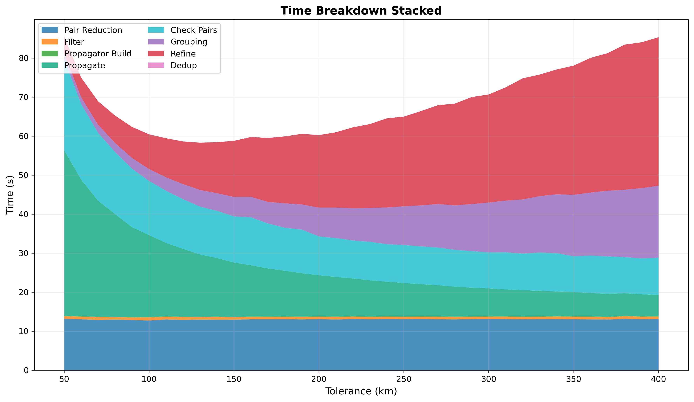
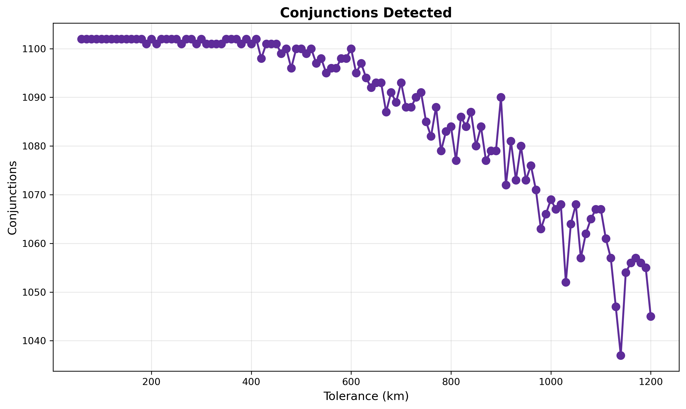

# Conjunction Tolerance Tuning

Final tuning of the coarse sweep tolerance parameter, with prepass, step ratio, and interpolation already optimized.

## Parameters

- **prepass-tolerance-km**: Fixed at 12.5 km (from prepass tuning)
- **step-second-ratio**: Fixed at 10 (from step ratio tuning)
- **interpolation-stride**: Fixed at 6 (from interpolation tuning)
- **tolerance-km**: Coarse detection threshold (swept from 50 to 400 km in steps of 10)
- **lookahead-hours**: Fixed at 24 hours
- **threshold-km**: Final conjunction threshold (fixed at 5.0 km)

## Pipeline Stages

The conjunction detection pipeline consists of 7 stages:

1. **Pair Reduction**: Geometric filtering to reduce candidate pairs (~13s, constant)
2. **Filter**: Rebuilding the catalog from reduced pairs (~0.6s, constant)
3. **Propagator Build**: Constructing TLE propagators (~0.1s, constant)
4. **Propagate**: Pre-computing positions for coarse sweep (decreases with tolerance)
5. **Check Pairs**: Distance checking during coarse sweep (decreases with tolerance)
6. **Grouping**: Clustering detections into events (increases with tolerance)
7. **Refine**: Brent's method optimization for precise TCA (increases with tolerance)

## Analysis

### Time Complexity Trade-off

The pipeline stages have opposing time complexities with respect to tolerance:

- **Propagate + Check Pairs - O(1/tolerance)**: Larger tolerance means larger step size, so fewer propagation calls and
  distance checks. Doubling tolerance roughly halves this time.
- **Grouping + Refine - O(tolerance)**: Larger tolerance catches more events that need grouping and refinement.
- **Pair Reduction, Filter, Propagator Build**: Essentially constant regardless of tolerance.

The optimal tolerance minimizes total time. As tolerance increases, propagate/check time decreases but grouping/refine
time increases. The U-shaped total time curve has its minimum where these opposing effects balance.

### Performance Curve

| Tolerance Range | Dominant Stage    | Behavior                                   |
|-----------------|-------------------|--------------------------------------------|
| under 100 km    | Propagate + Check | Many time steps, few events to refine      |
| 140 km          | **Balanced**      | Minimum total time (~58s)                  |
| 200+ km         | Grouping + Refine | Fewer coarse steps, many events to process |

### Conjunction Stability

Configurations up to ~400 km detect conjunctions consistently. Above 400 km, detection begins to
drop off slightly. This is likely due to interpolation error at stride=6 compounding with large step sizes, but it's
irrelevant in practice since optimal tolerance is well below this range.

## Conclusion

**Optimal tolerance is 140 km with step size of 14 seconds**

The optimal tolerance is where every part of the pipeline is balanced. Going lower wastes time on excessive
coarse iterations; going higher wastes time processing too many candidate events.

