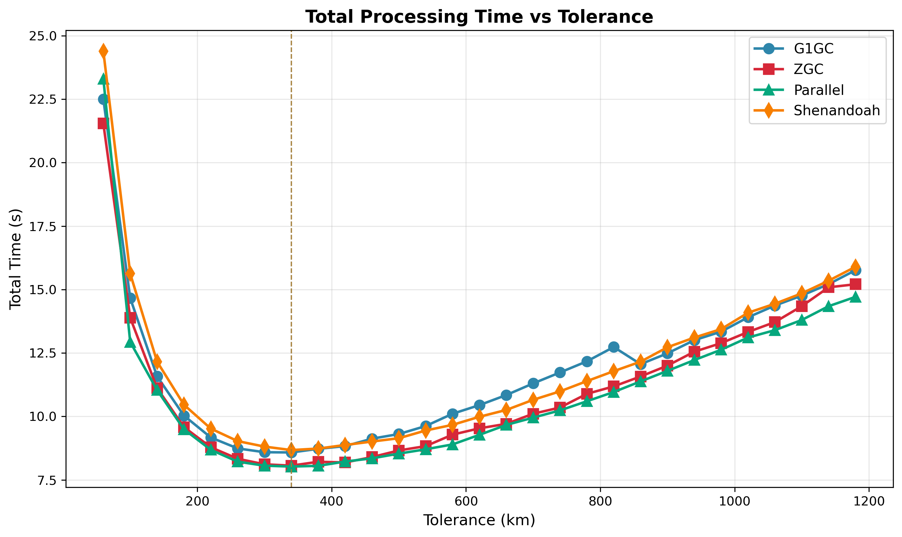

# Garbage Collector Selection

This experiment compares G1GC (default), ZGC, Parallel GC, and Shenandoah for conjunction detection workloads.

## Test Configuration

All benchmarks run with fixed heap size to eliminate memory variability:

```
-Xmx8g -Xms8g -XX:+AlwaysPreTouch
```

## Parameters

- **prepass-tolerance-km**: Fixed at 12.5 km
- **step-second-ratio**: Fixed at 10
- **interpolation-stride**: Fixed at 6
- **tolerance-km**: Swept from 60 to 1180 km
- **lookahead-hours**: Fixed at 24 hours
- **threshold-km**: Fixed at 5.0 km

## Results

Full satellite catalog (~30,000 satellites). Fastest run for each GC.

| GC         | Best Time | Tolerance | Coarse | Refine | vs Parallel |
|------------|-----------|-----------|--------|--------|-------------|
| Parallel   | 8.03s     | 340 km    | 3.76s  | 3.31s  | —           |
| ZGC        | 8.06s     | 340 km    | 3.76s  | 3.33s  | +0.4%       |
| G1GC       | 8.58s     | 340 km    | 3.92s  | 3.62s  | +6.9%       |
| Shenandoah | 8.67s     | 340 km    | 4.19s  | 3.50s  | +8.0%       |

Average across all tolerance values:

| GC         | Avg Time | Avg Coarse | Avg Refine |
|------------|----------|------------|------------|
| Parallel   | 10.99s   | 3.72s      | 6.20s      |
| ZGC        | 11.15s   | 3.68s      | 6.29s      |
| G1GC       | 11.85s   | 3.82s      | 6.86s      |
| Shenandoah | 11.89s   | 4.10s      | 6.63s      |

## Conclusion

**Parallel GC is 7% faster than G1GC for conjunction detection workloads.**

For scheduled batch processing where pause time doesn't matter, Parallel GC provides the best throughput. The Dockerfile
has been updated to use `-XX:+UseParallelGC`.

All GCs detect the same conjunctions (1022 at tolerance=340km). GC choice affects performance, not correctness.




